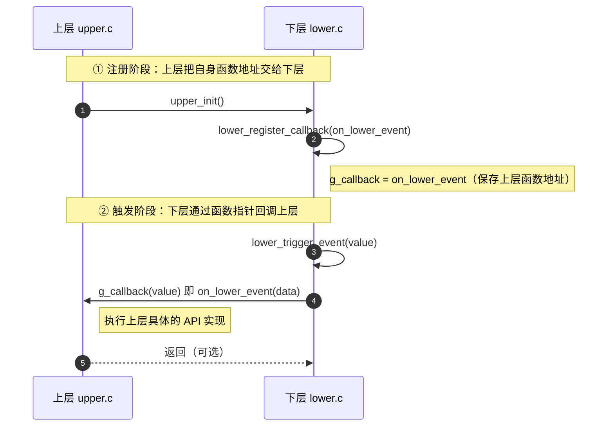

# C语言编程中，在分层框架中，下层如何调用上层的api ,下层如何调用下层的api ?


在C语言的分层框架中，层级间的调用关系有着严格的约定和特定的实现技巧。针对你的两个问题，我结合**编译链接原理**和**架构设计模式**，给出具体的技术方案。

### 先明确分层的基本规则
在经典的分层架构（如驱动层、服务层、应用层）中，**依赖方向永远是自上而下**（上层依赖下层）。因此：

- **下层调用上层（向上调用）**：违反了依赖方向，属于**架构反模式**。但在C语言中，若必须实现（如异步事件通知），只能通过**回调函数**或**消息队列**解耦。
- **下层调用下层（水平调用）**：同一层级内的模块互相调用，**技术上完全可行**，但需警惕**头文件循环依赖**。

---

### 1. 下层如何调用上层的 API（向上调用）

下层模块在编译时不知道上层模块的存在，无法直接包含上层的头文件或调用其符号。**最正统的解法是“依赖倒置”**：上层定义接口（函数指针），下层只调用指针，上层在初始化时将具体函数注册给下层。

**实现步骤（回调函数机制）：**

- **下层（lower.c / lower.h）**：定义函数指针类型，提供注册函数，在事件发生时调用该指针。

```c
// lower.h
#ifndef LOWER_H
#define LOWER_H

// 定义上层回调函数类型
typedef void (*upper_callback_t)(int data);

// 下层注册接口，供上层调用
void lower_register_callback(upper_callback_t cb);

// 下层触发事件（内部会调用回调）
void lower_trigger_event(int value);

#endif
```

```c
// lower.c
#include "lower.h"
#include <stdio.h>

static upper_callback_t g_callback = NULL; // 保存上层的函数地址

void lower_register_callback(upper_callback_t cb) {
    g_callback = cb;
}

void lower_trigger_event(int value) {
    if (g_callback) {
        g_callback(value); // 下层调用上层的API
    } else {
        printf("下层警告：上层未注册回调\n");
    }
}
```

- **上层（upper.c）**：实现具体API，并在初始化时将函数地址传给下层。

```c
// upper.c
#include "lower.h"
#include <stdio.h>

// 上层具体的API实现
static void on_lower_event(int data) {
    printf("上层收到下层事件，数据: %d\n", data);
}

void upper_init(void) {
    // 将上层函数注册给下层
    lower_register_callback(on_lower_event);
}
```
下层定义函数指针类型，并提供注册函数，下层注册函数负责保存传下来的参数，此时下层拿到了通知上层的回调函数指针了。
上层调用下层提供的服务是正常逻辑，上层调用下层的注册函数，把上层自己实现的函数作为注册函数参数传给下层。

**注意**：若系统复杂，建议改用**消息队列（异步）**，下层只发送消息，上层循环处理，避免直接回调带来的线程安全问题。

---

### 2. 下层如何调用下层的 API（水平调用）

同层模块间的调用是正常的函数调用，只需要处理好**头文件包含关系**即可。但最容易踩坑的是**循环依赖**（A调用B，B又调用A）。

**常规调用（无循环依赖）：**
假设有两个同层模块 `module_a` 和 `module_b`，`module_b` 需要调用 `module_a` 的API。

```c
// module_a.h
#ifndef MODULE_A_H
#define MODULE_A_H
void func_a(void);
#endif
```

```c
// module_b.c
#include "module_b.h"
#include "module_a.h" // 直接包含头文件

void func_b(void) {
    // 下层调用下层API
    func_a(); 
}
```

**解决循环依赖（使用前向声明或拆分接口）：**
如果 `module_a` 和 `module_b` 互相调用，需将公共类型或相互依赖的接口抽离到独立的 `module_common.h` 中，或者使用**不完整类型（前向声明）**。

```c
// module_b.h（前向声明方式）
#ifndef MODULE_B_H
#define MODULE_B_H

// 只声明结构体，不暴露内部细节
struct ModuleA;

void func_b(struct ModuleA *a_ptr);

#endif
```

```c
// module_b.c
#include "module_b.h"
#include "module_a.h" // 只有在 .c 中包含具体定义

void func_b(struct ModuleA *a_ptr) {
    // 此时可以使用 module_a 的API
    func_a(a_ptr);
}
```

---

### 补充：标准向下调用（上层调用下层）
虽然你没问，但为了完整理解框架，**正规的向下调用**只需下层暴露头文件和编译好的库（`.a`/`.so`），上层包含头文件并链接库即可，这是最常规的做法。

---

### 最佳实践建议
1. **禁止跨层调用**：下层绝不能调用上层的API，若必须通知上层，请使用**回调注册机制**，将耦合降到最低。
2. **水平调用限制**：同层模块间允许调用，但建议通过**本层的管理层（Manager）** 进行中介，避免网状调用导致维护困难。
3. **编译隔离**：下层的编译不应依赖上层的任何符号。如果使用了回调，下层的头文件和源码中不能出现上层特有的数据类型（只能使用`void*`或基本类型）。

如果你能提供具体的分层场景（如MCU裸机、Linux驱动、业务服务层），我可以给出更有针对性的避坑指南。