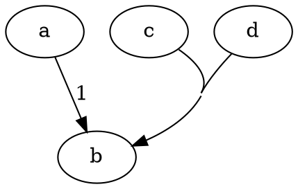
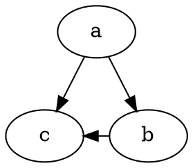
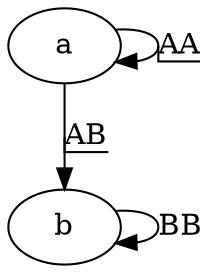

# 属性

自定义 Graphviz  [节点](https://graphviz.cpp.org.cn/docs/nodes/)、[边](https://graphviz.cpp.org.cn/docs/edges/)、[图形](https://graphviz.cpp.org.cn/docs/graph/)、子图和 [集群](https://graphviz.cpp.org.cn/docs/clusters/) 布局的说明。

下表描述了各种 Graphviz 工具使用的属性。表格给出了属性的名称、使用该属性的图形组件（节点、边等）以及属性的类型（表示该类型合法值的字符串）。在适用的情况下，表格还给出了属性的默认值、数值属性的最小允许设置，以及对使用属性的某些限制。

请注意，属性名称区分大小写。这通常也适用于属性值，除非另有说明。

所有 Graphviz 属性都由名称-值对指定。因此，要设置节点 `abc` 的 `color`，可以使用

```
digraph {
  abc [color = red]
}
```

类似地，要设置边 `abc -> def` 的箭头样式，可以使用

```
digraph {
  abc -> def [arrowhead = diamond]
}
```

有关属性设置的更多详细信息，请参阅 [DOT 语言](https://graphviz.cpp.org.cn/doc/info/lang.html) 的描述。

目前，大多数设备无关的单位要么是英寸，要么是 [点](https://en.wikipedia.org/wiki/Point_(typography))，我们将其视为每英寸 72 点。

**注意：** 某些属性，如 [`dir`](https://graphviz.cpp.org.cn/docs/attrs/dir/) 或 [`arrowtail`](https://graphviz.cpp.org.cn/docs/attrs/arrowtail/)，在 [DOT](https://graphviz.cpp.org.cn/doc/info/lang.html) 中与无向图一起使用时是模棱两可的，因为边的头和尾没有意义。根据惯例，无向边第一次出现时，[DOT](https://graphviz.cpp.org.cn/doc/info/lang.html) 解析器将分配左侧节点作为尾节点，右侧节点作为头节点。例如，边 `A -- B` 将具有尾部 `A` 和头部 `B`。用户有责任一致地处理此类边。如果边稍后以以下格式出现

```
graph {
  B -- A [taillabel = "tail"]
}
```

则绘制将把尾部标签附加到节点 `A`。为了避免在需要此类属性时可能出现混淆，建议用户使用有向图。如果必须使图形看起来像无向图，则可以使用 [`dir`](https://graphviz.cpp.org.cn/docs/attrs/dir/)、[`arrowtail`](https://graphviz.cpp.org.cn/docs/attrs/arrowtail/) 或 [`arrowhead`](https://graphviz.cpp.org.cn/docs/attrs/arrowhead/) 属性来完成。

这些工具接受标准 C 表示形式的 `int` 和 `double` 类型。对于 `bool` 类型，TRUE 值由 `true` 或 `yes`（不区分大小写）以及任何非零整数表示，FALSE 值由 `false` 或 `no`（不区分大小写）以及零表示。此外，还有各种专用类型，如 `arrowType`、`color`、`point` 和 `rankdir`。这些类型的合法值在最后给出。

**使用对象** 列字段指示属性适用于哪些图形组件。

在 **注释** 字段中，*只写* 的注释表示属性用于输出，而不被任何布局程序使用或读取。

| 名称                                                                              | [使用对象](https://graphviz.cpp.org.cn/doc/info/attrs.html#h:uses) | 类型                                                                                                                             | 默认值                                                                                | 最小值                               | 描述，注释                                                                                                                                                                                                                                                                                                                                                                |
| --------------------------------------------------------------------------------- | --------------------------------------------------------------- | -------------------------------------------------------------------------------------------------------------------------------- | ------------------------------------------------------------------------------------- | ------------------------------------ | ------------------------------------------------------------------------------------------------------------------------------------------------------------------------------------------------------------------------------------------------------------------------------------------------------------------------------------------------------------------------- |
| [`_background`](https://graphviz.cpp.org.cn/docs/attrs/background/)                | 图形                                                            | [xdot](https://graphviz.cpp.org.cn/docs/attr-types/xdot/)                                                                           | `<none>`                                                                            |                                      | 以[`xdot` 格式](https://graphviz.cpp.org.cn/docs/attr-types/xdot/) 指定任意背景的字符串。                                                                                                                                                                                                                                                                                  |
| [`area`](https://graphviz.cpp.org.cn/docs/attrs/area/)                             | 节点，集群                                                      | [double](https://graphviz.cpp.org.cn/docs/attr-types/double/)                                                                       | `1.0`                                                                               | `>0`                               | 指示节点或空集群的首选区域。仅限[patchwork](https://graphviz.cpp.org.cn/docs/layouts/patchwork/)。                                                                                                                                                                                                                                                                           |
| [`arrowhead`](https://graphviz.cpp.org.cn/docs/attrs/arrowhead/)                   | 边缘                                                            | [arrowType](https://graphviz.cpp.org.cn/docs/attr-types/arrowType/)                                                                 | `normal`                                                                            |                                      | 边头部节点上的箭头样式。                                                                                                                                                                                                                                                                                                                                                  |
| [`arrowsize`](https://graphviz.cpp.org.cn/docs/attrs/arrowsize/)                   | 边缘                                                            | [double](https://graphviz.cpp.org.cn/docs/attr-types/double/)                                                                       | `1.0`                                                                               | `0.0`                              | 箭头头的乘法比例因子。                                                                                                                                                                                                                                                                                                                                                    |
| [`arrowtail`](https://graphviz.cpp.org.cn/docs/attrs/arrowtail/)                   | 边缘                                                            | [arrowType](https://graphviz.cpp.org.cn/docs/attr-types/arrowType/)                                                                 | `normal`                                                                            |                                      | 边尾部节点上的箭头样式。                                                                                                                                                                                                                                                                                                                                                  |
| [`bb`](https://graphviz.cpp.org.cn/docs/attrs/bb/)                                 | 集群，图形                                                      | [rect](https://graphviz.cpp.org.cn/docs/attr-types/rect/)                                                                           |                                                                                       |                                      | 以点为单位的绘图边框。只写。                                                                                                                                                                                                                                                                                                                                              |
| [`beautify`](https://graphviz.cpp.org.cn/docs/attrs/beautify/)                     | 图形                                                            | [bool](https://graphviz.cpp.org.cn/docs/attr-types/bool/)                                                                           | `false`                                                                             |                                      | 是否在 sfdp 中将叶子节点均匀地绘制在根节点周围的圆圈中。仅限[sfdp](https://graphviz.cpp.org.cn/docs/layouts/sfdp/)。                                                                                                                                                                                                                                                         |
| [`bgcolor`](https://graphviz.cpp.org.cn/docs/attrs/bgcolor/)                       | 图形，集群                                                      | [color](https://graphviz.cpp.org.cn/docs/attr-types/color/)，[colorList](https://graphviz.cpp.org.cn/docs/attr-types/colorList/)       | `<none>`                                                                            |                                      | 画布背景颜色。                                                                                                                                                                                                                                                                                                                                                            |
| [`center`](https://graphviz.cpp.org.cn/docs/attrs/center/)                         | 图形                                                            | [bool](https://graphviz.cpp.org.cn/docs/attr-types/bool/)                                                                           | `false`                                                                             |                                      | 是否将图形居中于输出画布中。                                                                                                                                                                                                                                                                                                                                              |
| [`charset`](https://graphviz.cpp.org.cn/docs/attrs/charset/)                       | 图形                                                            | [string](https://graphviz.cpp.org.cn/docs/attr-types/string/)                                                                       | `"UTF-8"`                                                                           |                                      | 解释字符串输入作为文本标签时使用的字符编码。                                                                                                                                                                                                                                                                                                                              |
| [`class`](https://graphviz.cpp.org.cn/docs/attrs/class/)                           | 边缘，节点，集群，图形                                          | [string](https://graphviz.cpp.org.cn/docs/attr-types/string/)                                                                       | `""`                                                                                |                                      | 要附加到节点、边、图形或集群的 SVG 元素的类名。仅限[svg](https://graphviz.cpp.org.cn/docs/outputs/svg/)。                                                                                                                                                                                                                                                                    |
| [`cluster`](https://graphviz.cpp.org.cn/docs/attrs/cluster/)                       | 集群，子图                                                      | [bool](https://graphviz.cpp.org.cn/docs/attr-types/bool/)                                                                           | `false`                                                                             |                                      | 子图是否为集群。                                                                                                                                                                                                                                                                                                                                                          |
| [`clusterrank`](https://graphviz.cpp.org.cn/docs/attrs/clusterrank/)               | 图形                                                            | [clusterMode](https://graphviz.cpp.org.cn/docs/attr-types/clusterMode/)                                                             | `local`                                                                             |                                      | 用于处理集群的模式。仅限[dot](https://graphviz.cpp.org.cn/docs/layouts/dot/)。                                                                                                                                                                                                                                                                                               |
| [`color`](https://graphviz.cpp.org.cn/docs/attrs/color/)                           | 边缘，节点，集群                                                | [color](https://graphviz.cpp.org.cn/docs/attr-types/color/)，[colorList](https://graphviz.cpp.org.cn/docs/attr-types/colorList/)       | `black`                                                                             |                                      | 图形的基本绘制颜色，而不是文本。                                                                                                                                                                                                                                                                                                                                          |
| [`colorscheme`](https://graphviz.cpp.org.cn/docs/attrs/colorscheme/)               | 边缘，节点，集群，图形                                          | [string](https://graphviz.cpp.org.cn/docs/attr-types/string/)                                                                       | `""`                                                                                |                                      | 颜色方案命名空间：解释颜色名称的上下文。                                                                                                                                                                                                                                                                                                                                  |
| [`comment`](https://graphviz.cpp.org.cn/docs/attrs/comment/)                       | 边缘，节点，图形                                                | [string](https://graphviz.cpp.org.cn/docs/attr-types/string/)                                                                       | `""`                                                                                |                                      | 注释被插入到输出中。                                                                                                                                                                                                                                                                                                                                                      |
| [`compound`](https://graphviz.cpp.org.cn/docs/attrs/compound/)                     | 图形                                                            | [bool](https://graphviz.cpp.org.cn/docs/attr-types/bool/)                                                                           | `false`                                                                             |                                      | 如果为真，则允许集群之间的边。仅限[dot](https://graphviz.cpp.org.cn/docs/layouts/dot/)。                                                                                                                                                                                                                                                                                     |
| [`concentrate`](https://graphviz.cpp.org.cn/docs/attrs/concentrate/)               | 图形                                                            | [bool](https://graphviz.cpp.org.cn/docs/attr-types/bool/)                                                                           | `false`                                                                             |                                      | 如果为真，则使用边集中器。                                                                                                                                                                                                                                                                                                                                                |
| [`constraint`](https://graphviz.cpp.org.cn/docs/attrs/constraint/)                 | 边缘                                                            | [bool](https://graphviz.cpp.org.cn/docs/attr-types/bool/)                                                                           | `true`                                                                              |                                      | 如果为假，则边不用于对节点进行排名。仅限[dot](https://graphviz.cpp.org.cn/docs/layouts/dot/)。                                                                                                                                                                                                                                                                               |
| [`Damping`](https://graphviz.cpp.org.cn/docs/attrs/Damping/)                       | 图形                                                            | [double](https://graphviz.cpp.org.cn/docs/attr-types/double/)                                                                       | `0.99`                                                                              | `0.0`                              | 阻尼力运动的因子。仅限[neato](https://graphviz.cpp.org.cn/docs/layouts/neato/)。                                                                                                                                                                                                                                                                                             |
| [`decorate`](https://graphviz.cpp.org.cn/docs/attrs/decorate/)                     | 边缘                                                            | [bool](https://graphviz.cpp.org.cn/docs/attr-types/bool/)                                                                           | `false`                                                                             |                                      | 是否使用线将边标签连接到边。                                                                                                                                                                                                                                                                                                                                              |
| [`defaultdist`](https://graphviz.cpp.org.cn/docs/attrs/defaultdist/)               | 图形                                                            | [double](https://graphviz.cpp.org.cn/docs/attr-types/double/)                                                                       | `1+(avg. len)*sqrt(\|V\|)`                                                            | `epsilon`                          | 不同连通分量中节点之间的距离。仅限[neato](https://graphviz.cpp.org.cn/docs/layouts/neato/)。                                                                                                                                                                                                                                                                                 |
| [`dim`](https://graphviz.cpp.org.cn/docs/attrs/dim/)                               | 图形                                                            | [int](https://graphviz.cpp.org.cn/docs/attr-types/int/)                                                                             | `2`                                                                                 | `2`                                | 设置用于布局的维数。仅限[neato](https://graphviz.cpp.org.cn/docs/layouts/neato/)、[fdp](https://graphviz.cpp.org.cn/docs/layouts/fdp/)、[sfdp](https://graphviz.cpp.org.cn/docs/layouts/sfdp/)。                                                                                                                                                                                   |
| [`dimen`](https://graphviz.cpp.org.cn/docs/attrs/dimen/)                           | 图形                                                            | [int](https://graphviz.cpp.org.cn/docs/attr-types/int/)                                                                             | `2`                                                                                 | `2`                                | 设置用于渲染的维数。仅限[neato](https://graphviz.cpp.org.cn/docs/layouts/neato/)、[fdp](https://graphviz.cpp.org.cn/docs/layouts/fdp/)、[sfdp](https://graphviz.cpp.org.cn/docs/layouts/sfdp/)。                                                                                                                                                                                   |
| [`dir`](https://graphviz.cpp.org.cn/docs/attrs/dir/)                               | 边缘                                                            | [dirType](https://graphviz.cpp.org.cn/docs/attr-types/dirType/)                                                                     | `forward`（有向）`none`（无向）                                                   |                                      | 用于绘制箭头头的边缘类型。                                                                                                                                                                                                                                                                                                                                                |
| [`diredgeconstraints`](https://graphviz.cpp.org.cn/docs/attrs/diredgeconstraints/) | 图形                                                            | [字符串](https://graphviz.cpp.org.cn/docs/attr-types/string/)，[布尔值](https://graphviz.cpp.org.cn/docs/attr-types/bool/)             | `false`                                                                             |                                      | 是否将大多数边缘限制为指向下方。 仅限[neato](https://graphviz.cpp.org.cn/docs/layouts/neato/)。                                                                                                                                                                                                                                                                              |
| [`distortion`](https://graphviz.cpp.org.cn/docs/attrs/distortion/)                 | 节点                                                            | [double](https://graphviz.cpp.org.cn/docs/attr-types/double/)                                                                       | `0.0`                                                                               | `-100.0`                           | `<a href="https://graphviz.cpp.org.cn/docs/attrs/shape/">shape</a>=<a href="https://graphviz.cpp.org.cn/doc/info/shapes.html#polygon">polygon</a>` 的扭曲因子。                                                                                                                                                                                                         |
| [`dpi`](https://graphviz.cpp.org.cn/docs/attrs/dpi/)                               | 图形                                                            | [double](https://graphviz.cpp.org.cn/docs/attr-types/double/)                                                                       | `96.0``0.0`                                                                         |                                      | 指定显示设备上每英寸的预期像素数。 位图输出，仅限[svg](https://graphviz.cpp.org.cn/docs/outputs/svg/)。                                                                                                                                                                                                                                                                      |
| [`edgehref`](https://graphviz.cpp.org.cn/docs/attrs/edgehref/)                     | 边缘                                                            | [escString](https://graphviz.cpp.org.cn/docs/attr-types/escString/)                                                                 | `""`                                                                                |                                      | [`edgeURL`](https://graphviz.cpp.org.cn/docs/attrs/edgeURL/) 的同义词。 地图，仅限[svg](https://graphviz.cpp.org.cn/docs/outputs/svg/)。                                                                                                                                                                                                                                      |
| [`edgetarget`](https://graphviz.cpp.org.cn/docs/attrs/edgetarget/)                 | 边缘                                                            | [escString](https://graphviz.cpp.org.cn/docs/attr-types/escString/)                                                                 | `<none>`                                                                            |                                      | 用于[`edgeURL`](https://graphviz.cpp.org.cn/docs/attrs/edgeURL/) 链接的浏览器窗口。 地图，仅限[svg](https://graphviz.cpp.org.cn/docs/outputs/svg/)。                                                                                                                                                                                                                          |
| [`edgetooltip`](https://graphviz.cpp.org.cn/docs/attrs/edgetooltip/)               | 边缘                                                            | [escString](https://graphviz.cpp.org.cn/docs/attr-types/escString/)                                                                 | `""`                                                                                |                                      | 附加到边缘非标签部分的工具提示注释。 仅限[cmap](https://graphviz.cpp.org.cn/docs/outputs/cmap/)，[svg](https://graphviz.cpp.org.cn/docs/outputs/svg/)。                                                                                                                                                                                                                         |
| [`edgeURL`](https://graphviz.cpp.org.cn/docs/attrs/edgeURL/)                       | 边缘                                                            | [escString](https://graphviz.cpp.org.cn/docs/attr-types/escString/)                                                                 | `""`                                                                                |                                      | 边缘非标签部分的链接。 地图，仅限[svg](https://graphviz.cpp.org.cn/docs/outputs/svg/)。                                                                                                                                                                                                                                                                                      |
| [`epsilon`](https://graphviz.cpp.org.cn/docs/attrs/epsilon/)                       | 图形                                                            | [double](https://graphviz.cpp.org.cn/docs/attr-types/double/)                                                                       | `.0001 * # 节点` (mode == KK)`.0001` (mode == major)`.01` (mode == sgd)         |                                      | 终止条件。 仅限[neato](https://graphviz.cpp.org.cn/docs/layouts/neato/)。                                                                                                                                                                                                                                                                                                    |
| [`esep`](https://graphviz.cpp.org.cn/docs/attrs/esep/)                             | 图形                                                            | [addDouble](https://graphviz.cpp.org.cn/docs/attr-types/addDouble/)，[addPoint](https://graphviz.cpp.org.cn/docs/attr-types/addPoint/) | `+3`                                                                                |                                      | 用于样条边缘路由的，围绕多边形的边距。 仅限[neato](https://graphviz.cpp.org.cn/docs/layouts/neato/)，[fdp](https://graphviz.cpp.org.cn/docs/layouts/fdp/)，[sfdp](https://graphviz.cpp.org.cn/docs/layouts/sfdp/)，osage，[circo](https://graphviz.cpp.org.cn/docs/layouts/circo/)，[twopi](https://graphviz.cpp.org.cn/docs/layouts/twopi/)。                                           |
| [`fillcolor`](https://graphviz.cpp.org.cn/docs/attrs/fillcolor/)                   | 节点，边缘，集群                                                | [color](https://graphviz.cpp.org.cn/docs/attr-types/color/)，[colorList](https://graphviz.cpp.org.cn/docs/attr-types/colorList/)       | `lightgrey` (节点)`black` (集群)                                                  |                                      | 用于填充节点或集群背景的颜色。                                                                                                                                                                                                                                                                                                                                            |
| [`fixedsize`](https://graphviz.cpp.org.cn/docs/attrs/fixedsize/)                   | 节点                                                            | [布尔值](https://graphviz.cpp.org.cn/docs/attr-types/bool/)，[字符串](https://graphviz.cpp.org.cn/docs/attr-types/string/)             | `false`                                                                             |                                      | 是否使用指定的宽度和高度属性来选择节点大小（而不是调整大小以适合节点内容）。                                                                                                                                                                                                                                                                                              |
| [`fontcolor`](https://graphviz.cpp.org.cn/docs/attrs/fontcolor/)                   | 边缘，节点，图形，集群                                          | [color](https://graphviz.cpp.org.cn/docs/attr-types/color/)                                                                         | `black`                                                                             |                                      | 用于文本的颜色。                                                                                                                                                                                                                                                                                                                                                          |
| [`fontname`](https://graphviz.cpp.org.cn/docs/attrs/fontname/)                     | 边缘，节点，图形，集群                                          | [string](https://graphviz.cpp.org.cn/docs/attr-types/string/)                                                                       | `"Times-Roman"`                                                                     |                                      | 用于文本的字体。                                                                                                                                                                                                                                                                                                                                                          |
| [`fontnames`](https://graphviz.cpp.org.cn/docs/attrs/fontnames/)                   | 图形                                                            | [string](https://graphviz.cpp.org.cn/docs/attr-types/string/)                                                                       | `""`                                                                                |                                      | 允许用户控制在 SVG 输出中如何表示基本字体名称。 仅限[svg](https://graphviz.cpp.org.cn/docs/outputs/svg/)。                                                                                                                                                                                                                                                                   |
| [`fontpath`](https://graphviz.cpp.org.cn/docs/attrs/fontpath/)                     | 图形                                                            | [string](https://graphviz.cpp.org.cn/docs/attr-types/string/)                                                                       | `<系统相关>`                                                                        |                                      | [libgd](https://libgd.github.io/) 用于搜索位图字体的目录列表。                                                                                                                                                                                                                                                                                                               |
| [`fontsize`](https://graphviz.cpp.org.cn/docs/attrs/fontsize/)                     | 边缘，节点，图形，集群                                          | [double](https://graphviz.cpp.org.cn/docs/attr-types/double/)                                                                       | `14.0`                                                                              | `1.0`                              | 文本使用的字体大小，[以点为单位](https://graphviz.cpp.org.cn/doc/info/attrs.html#points)。                                                                                                                                                                                                                                                                                   |
| [`forcelabels`](https://graphviz.cpp.org.cn/docs/attrs/forcelabels/)               | 图形                                                            | [bool](https://graphviz.cpp.org.cn/docs/attr-types/bool/)                                                                           | `true`                                                                              |                                      | 是否强制放置所有[`xlabels`](https://graphviz.cpp.org.cn/docs/attrs/xlabel/)，即使它们重叠。                                                                                                                                                                                                                                                                                |
| [`gradientangle`](https://graphviz.cpp.org.cn/docs/attrs/gradientangle/)           | 节点，集群，图形                                                | [int](https://graphviz.cpp.org.cn/docs/attr-types/int/)                                                                             | `0`                                                                                 | `0`                                | 如果使用渐变填充，则确定填充的角度。                                                                                                                                                                                                                                                                                                                                      |
| [`group`](https://graphviz.cpp.org.cn/docs/attrs/group/)                           | 节点                                                            | [string](https://graphviz.cpp.org.cn/docs/attr-types/string/)                                                                       | `""`                                                                                |                                      | 节点组的名称，用于捆绑边缘并避免交叉。 仅限[dot](https://graphviz.cpp.org.cn/docs/layouts/dot/)。                                                                                                                                                                                                                                                                            |
| [`head_lp`](https://graphviz.cpp.org.cn/docs/attrs/head_lp/)                       | 边缘                                                            | [point](https://graphviz.cpp.org.cn/docs/attr-types/point/)                                                                         |                                                                                       |                                      | 边缘头部标签的中心位置。 仅写。                                                                                                                                                                                                                                                                                                                                           |
| [`headclip`](https://graphviz.cpp.org.cn/docs/attrs/headclip/)                     | 边缘                                                            | [bool](https://graphviz.cpp.org.cn/docs/attr-types/bool/)                                                                           | `true`                                                                              |                                      | 如果为真，则边缘的头部将被剪切到头部节点的边界。                                                                                                                                                                                                                                                                                                                          |
| [`headhref`](https://graphviz.cpp.org.cn/docs/attrs/headhref/)                     | 边缘                                                            | [escString](https://graphviz.cpp.org.cn/docs/attr-types/escString/)                                                                 | `""`                                                                                |                                      | [`headURL`](https://graphviz.cpp.org.cn/docs/attrs/headURL/) 的同义词。 地图，仅限[svg](https://graphviz.cpp.org.cn/docs/outputs/svg/)。                                                                                                                                                                                                                                      |
| [`headlabel`](https://graphviz.cpp.org.cn/docs/attrs/headlabel/)                   | 边缘                                                            | [lblString](https://graphviz.cpp.org.cn/docs/attr-types/lblString/)                                                                 | `""`                                                                                |                                      | 要放置在边缘头部附近的文本标签。                                                                                                                                                                                                                                                                                                                                          |
| [`headport`](https://graphviz.cpp.org.cn/docs/attrs/headport/)                     | 边缘                                                            | [portPos](https://graphviz.cpp.org.cn/docs/attr-types/portPos/)                                                                     | `center`                                                                            |                                      | 指示在头部节点的哪个位置连接边缘的头部。                                                                                                                                                                                                                                                                                                                                  |
| [`headtarget`](https://graphviz.cpp.org.cn/docs/attrs/headtarget/)                 | 边缘                                                            | [escString](https://graphviz.cpp.org.cn/docs/attr-types/escString/)                                                                 | `<none>`                                                                            |                                      | 用于[`headURL`](https://graphviz.cpp.org.cn/docs/attrs/headURL/) 链接的浏览器窗口。 地图，仅限[svg](https://graphviz.cpp.org.cn/docs/outputs/svg/)。                                                                                                                                                                                                                          |
| [`headtooltip`](https://graphviz.cpp.org.cn/docs/attrs/headtooltip/)               | 边缘                                                            | [escString](https://graphviz.cpp.org.cn/docs/attr-types/escString/)                                                                 | `""`                                                                                |                                      | 附加到边缘头部的工具提示注释。 仅限[cmap](https://graphviz.cpp.org.cn/docs/outputs/cmap/)，[svg](https://graphviz.cpp.org.cn/docs/outputs/svg/)。                                                                                                                                                                                                                               |
| [`headURL`](https://graphviz.cpp.org.cn/docs/attrs/headURL/)                       | 边缘                                                            | [escString](https://graphviz.cpp.org.cn/docs/attr-types/escString/)                                                                 | `""`                                                                                |                                      | 如果已定义，则 `headURL` 将作为边缘头部标签的一部分输出。 地图，仅限[svg](https://graphviz.cpp.org.cn/docs/outputs/svg/)。                                                                                                                                                                                                                                                 |
| [`height`](https://graphviz.cpp.org.cn/docs/attrs/height/)                         | 节点                                                            | [double](https://graphviz.cpp.org.cn/docs/attr-types/double/)                                                                       | `0.5`                                                                               | `0.02`                             | 节点的高度，以英寸为单位。                                                                                                                                                                                                                                                                                                                                                |
| [`href`](https://graphviz.cpp.org.cn/docs/attrs/href/)                             | 图形，集群，节点，边缘                                          | [escString](https://graphviz.cpp.org.cn/docs/attr-types/escString/)                                                                 | `""`                                                                                |                                      | [`URL`](https://graphviz.cpp.org.cn/docs/attrs/URL/) 的同义词。 地图，仅限[postscript](https://graphviz.cpp.org.cn/docs/outputs/ps/)，[svg](https://graphviz.cpp.org.cn/docs/outputs/svg/)。                                                                                                                                                                                     |
| [`id`](https://graphviz.cpp.org.cn/docs/attrs/id/)                                 | 图形，集群，节点，边缘                                          | [escString](https://graphviz.cpp.org.cn/docs/attr-types/escString/)                                                                 | `""`                                                                                |                                      | 图形对象的标识符。 地图，仅限[postscript](https://graphviz.cpp.org.cn/docs/outputs/ps/)，[svg](https://graphviz.cpp.org.cn/docs/outputs/svg/)。                                                                                                                                                                                                                                 |
| [`image`](https://graphviz.cpp.org.cn/docs/attrs/image/)                           | 节点                                                            | [string](https://graphviz.cpp.org.cn/docs/attr-types/string/)                                                                       | `""`                                                                                |                                      | 给出包含要显示在节点内的图像的文件的名称。                                                                                                                                                                                                                                                                                                                                |
| [`imagepath`](https://graphviz.cpp.org.cn/docs/attrs/imagepath/)                   | 图形                                                            | [string](https://graphviz.cpp.org.cn/docs/attr-types/string/)                                                                       | `""`                                                                                |                                      | 要查找图像文件的目录列表。                                                                                                                                                                                                                                                                                                                                                |
| [`imagepos`](https://graphviz.cpp.org.cn/docs/attrs/imagepos/)                     | 节点                                                            | [string](https://graphviz.cpp.org.cn/docs/attr-types/string/)                                                                       | `"mc"`                                                                              |                                      | 控制图像在其包含节点内的位置。                                                                                                                                                                                                                                                                                                                                            |
| [`imagescale`](https://graphviz.cpp.org.cn/docs/attrs/imagescale/)                 | 节点                                                            | [布尔值](https://graphviz.cpp.org.cn/docs/attr-types/bool/)，[字符串](https://graphviz.cpp.org.cn/docs/attr-types/string/)             | `false`                                                                             |                                      | 控制图像如何填充其包含节点。                                                                                                                                                                                                                                                                                                                                              |
| [`inputscale`](https://graphviz.cpp.org.cn/docs/attrs/inputscale/)                 | 图形                                                            | [double](https://graphviz.cpp.org.cn/docs/attr-types/double/)                                                                       | `<none>`                                                                            |                                      | 缩放输入[位置](https://graphviz.cpp.org.cn/docs/attrs/pos/) 以在长度单位之间进行转换。 仅限[neato](https://graphviz.cpp.org.cn/docs/layouts/neato/)，[fdp](https://graphviz.cpp.org.cn/docs/layouts/fdp/)。                                                                                                                                                                        |
| [`K`](https://graphviz.cpp.org.cn/docs/attrs/K/)                                   | 图形，集群                                                      | [double](https://graphviz.cpp.org.cn/docs/attr-types/double/)                                                                       | `0.3`                                                                               | `0`                                | 虚拟物理模型中使用的弹簧常数。 仅限[fdp](https://graphviz.cpp.org.cn/docs/layouts/fdp/)，[sfdp](https://graphviz.cpp.org.cn/docs/layouts/sfdp/)。                                                                                                                                                                                                                               |
| [`label`](https://graphviz.cpp.org.cn/docs/attrs/label/)                           | 边缘，节点，图形，集群                                          | [lblString](https://graphviz.cpp.org.cn/docs/attr-types/lblString/)                                                                 | `"\N"` (节点)`""` (其他)                                                          |                                      | 附加到对象的文本标签。                                                                                                                                                                                                                                                                                                                                                    |
| [`label_scheme`](https://graphviz.cpp.org.cn/docs/attrs/label_scheme/)             | 图形                                                            | [int](https://graphviz.cpp.org.cn/docs/attr-types/int/)                                                                             | `0`                                                                                 | `0`                                | 是否将名称为 `\|edgelabel\|*` 的节点视为表示边缘标签的特殊节点。 仅限[sfdp](https://graphviz.cpp.org.cn/docs/layouts/sfdp/)。                                                                                                                                                                                                                                                |
| [`labelangle`](https://graphviz.cpp.org.cn/docs/attrs/labelangle/)                 | 边缘                                                            | [double](https://graphviz.cpp.org.cn/docs/attr-types/double/)                                                                       | `-25.0`                                                                             | `-180.0`                           | 头部和尾部边缘标签的极坐标角度（以度为单位）。                                                                                                                                                                                                                                                                                                                            |
| [`labeldistance`](https://graphviz.cpp.org.cn/docs/attrs/labeldistance/)           | 边缘                                                            | [double](https://graphviz.cpp.org.cn/docs/attr-types/double/)                                                                       | `1.0`                                                                               | `0.0`                              | [`headlabel`](https://graphviz.cpp.org.cn/docs/attrs/headlabel/) / [`taillabel`](https://graphviz.cpp.org.cn/docs/attrs/taillabel/) 与头部/尾部节点之间的距离的缩放因子。                                                                                                                                                                                                   |
| [`labelfloat`](https://graphviz.cpp.org.cn/docs/attrs/labelfloat/)                 | 边缘                                                            | [bool](https://graphviz.cpp.org.cn/docs/attr-types/bool/)                                                                           | `false`                                                                             |                                      | 如果为真，则允许边缘标签在位置上不太受约束。                                                                                                                                                                                                                                                                                                                              |
| [`labelfontcolor`](https://graphviz.cpp.org.cn/docs/attrs/labelfontcolor/)         | 边缘                                                            | [color](https://graphviz.cpp.org.cn/docs/attr-types/color/)                                                                         | `black`                                                                             |                                      | 用于[`headlabel`](https://graphviz.cpp.org.cn/docs/attrs/headlabel/) 和[`taillabel`](https://graphviz.cpp.org.cn/docs/attrs/taillabel/) 的颜色。                                                                                                                                                                                                                            |
| [`labelfontname`](https://graphviz.cpp.org.cn/docs/attrs/labelfontname/)           | 边缘                                                            | [string](https://graphviz.cpp.org.cn/docs/attr-types/string/)                                                                       | `"Times-Roman"`                                                                     |                                      | `headlabel` 和 `taillabel` 的字体。                                                                                                                                                                                                                                                                                                                                   |
| [`labelfontsize`](https://graphviz.cpp.org.cn/docs/attrs/labelfontsize/)           | 边缘                                                            | [double](https://graphviz.cpp.org.cn/docs/attr-types/double/)                                                                       | `14.0`                                                                              | `1.0`                              | `headlabel` 和 `taillabel` 的字体大小。                                                                                                                                                                                                                                                                                                                               |
| [`labelhref`](https://graphviz.cpp.org.cn/docs/attrs/labelhref/)                   | 边缘                                                            | [escString](https://graphviz.cpp.org.cn/docs/attr-types/escString/)                                                                 | `""`                                                                                |                                      | [`labelURL`](https://graphviz.cpp.org.cn/docs/attrs/labelURL/) 的同义词。 地图，仅限[svg](https://graphviz.cpp.org.cn/docs/outputs/svg/)。                                                                                                                                                                                                                                    |
| [`labeljust`](https://graphviz.cpp.org.cn/docs/attrs/labeljust/)                   | 图形，集群                                                      | [string](https://graphviz.cpp.org.cn/docs/attr-types/string/)                                                                       | `"c"`                                                                               |                                      | 图形和集群标签的对齐方式。                                                                                                                                                                                                                                                                                                                                                |
| [`labelloc`](https://graphviz.cpp.org.cn/docs/attrs/labelloc/)                     | 节点，图形，集群                                                | [string](https://graphviz.cpp.org.cn/docs/attr-types/string/)                                                                       | `"t"` (集群)`"b"` (根图形)`"c"` (节点)                                          |                                      | 节点，根图形和集群的标签的垂直放置。                                                                                                                                                                                                                                                                                                                                      |
| [`labeltarget`](https://graphviz.cpp.org.cn/docs/attrs/labeltarget/)               | 边缘                                                            | [escString](https://graphviz.cpp.org.cn/docs/attr-types/escString/)                                                                 | `<none>`                                                                            |                                      | 用于打开[`labelURL`](https://graphviz.cpp.org.cn/docs/attrs/labelURL/) 链接的浏览器窗口。 地图，仅限[svg](https://graphviz.cpp.org.cn/docs/outputs/svg/)。                                                                                                                                                                                                                    |
| [`labeltooltip`](https://graphviz.cpp.org.cn/docs/attrs/labeltooltip/)             | 边缘                                                            | [escString](https://graphviz.cpp.org.cn/docs/attr-types/escString/)                                                                 | `""`                                                                                |                                      | 附加到边缘标签的工具提示注释。 仅限[cmap](https://graphviz.cpp.org.cn/docs/outputs/cmap/)，[svg](https://graphviz.cpp.org.cn/docs/outputs/svg/)。                                                                                                                                                                                                                               |
| [`labelURL`](https://graphviz.cpp.org.cn/docs/attrs/labelURL/)                     | 边缘                                                            | [escString](https://graphviz.cpp.org.cn/docs/attr-types/escString/)                                                                 | `""`                                                                                |                                      | 如果已定义，则 `labelURL` 是用于边缘标签的链接。 地图，仅限[svg](https://graphviz.cpp.org.cn/docs/outputs/svg/)。                                                                                                                                                                                                                                                          |
| [`landscape`](https://graphviz.cpp.org.cn/docs/attrs/landscape/)                   | 图形                                                            | [bool](https://graphviz.cpp.org.cn/docs/attr-types/bool/)                                                                           | `false`                                                                             |                                      | 如果为真，则图形将以横向模式呈现。                                                                                                                                                                                                                                                                                                                                        |
| [`layer`](https://graphviz.cpp.org.cn/docs/attrs/layer/)                           | 边缘，节点，集群                                                | [layerRange](https://graphviz.cpp.org.cn/docs/attr-types/layerRange/)                                                               | `""`                                                                                |                                      | 指定节点，边缘或集群所在的层。                                                                                                                                                                                                                                                                                                                                            |
| [`layerlistsep`](https://graphviz.cpp.org.cn/docs/attrs/layerlistsep/)             | 图形                                                            | [string](https://graphviz.cpp.org.cn/docs/attr-types/string/)                                                                       | `","`                                                                               |                                      | 用于将类型为[`layerRange`](https://graphviz.cpp.org.cn/docs/attr-types/layerRange/) 的属性拆分为范围列表的分隔符。                                                                                                                                                                                                                                                         |
| [`layers`](https://graphviz.cpp.org.cn/docs/attrs/layers/)                         | 图形                                                            | [layerList](https://graphviz.cpp.org.cn/docs/attr-types/layerList/)                                                                 | `""`                                                                                |                                      | 附加到图形的线性排序的层名称列表。                                                                                                                                                                                                                                                                                                                                        |
| [`layerselect`](https://graphviz.cpp.org.cn/docs/attrs/layerselect/)               | 图形                                                            | [layerRange](https://graphviz.cpp.org.cn/docs/attr-types/layerRange/)                                                               | `""`                                                                                |                                      | 选择要发出的层列表。                                                                                                                                                                                                                                                                                                                                                      |
| [`layersep`](https://graphviz.cpp.org.cn/docs/attrs/layersep/)                     | 图形                                                            | [string](https://graphviz.cpp.org.cn/docs/attr-types/string/)                                                                       | `":\t "`                                                                            |                                      | 用于将[`layers`](https://graphviz.cpp.org.cn/docs/attrs/layers/) 属性拆分为层名称列表的分隔符。                                                                                                                                                                                                                                                                            |
| [`layout`](https://graphviz.cpp.org.cn/docs/attrs/layout/)                         | 图形                                                            | [string](https://graphviz.cpp.org.cn/docs/attr-types/string/)                                                                       | `""`                                                                                |                                      | 要使用的[布局引擎](https://graphviz.cpp.org.cn/docs/layouts/)。                                                                                                                                                                                                                                                                                                              |
| [`len`](https://graphviz.cpp.org.cn/docs/attrs/len/)                               | 边缘                                                            | [double](https://graphviz.cpp.org.cn/docs/attr-types/double/)                                                                       | `1.0` (neato)`0.3` (fdp)                                                          |                                      | 首选的边缘长度，以英寸为单位。 仅限[neato](https://graphviz.cpp.org.cn/docs/layouts/neato/)，[fdp](https://graphviz.cpp.org.cn/docs/layouts/fdp/)。                                                                                                                                                                                                                             |
| [`levels`](https://graphviz.cpp.org.cn/docs/attrs/levels/)                         | 图形                                                            | [int](https://graphviz.cpp.org.cn/docs/attr-types/int/)                                                                             | `INT_MAX`                                                                           | `0.0`                              | 多级方案中允许的级数。 仅限[sfdp](https://graphviz.cpp.org.cn/docs/layouts/sfdp/)。                                                                                                                                                                                                                                                                                          |
| [`levelsgap`](https://graphviz.cpp.org.cn/docs/attrs/levelsgap/)                   | 图形                                                            | [double](https://graphviz.cpp.org.cn/docs/attr-types/double/)                                                                       | `0.0`                                                                               |                                      | neato 级别约束的严格性。 仅限[neato](https://graphviz.cpp.org.cn/docs/layouts/neato/)。                                                                                                                                                                                                                                                                                      |
| [`lhead`](https://graphviz.cpp.org.cn/docs/attrs/lhead/)                           | 边缘                                                            | [string](https://graphviz.cpp.org.cn/docs/attr-types/string/)                                                                       | `""`                                                                                |                                      | 边缘的逻辑头部。 仅限[dot](https://graphviz.cpp.org.cn/docs/layouts/dot/)。                                                                                                                                                                                                                                                                                                  |
| [`lheight`](https://graphviz.cpp.org.cn/docs/attrs/lheight/)                       | 图形，集群                                                      | [double](https://graphviz.cpp.org.cn/docs/attr-types/double/)                                                                       |                                                                                       |                                      | 图形或集群标签的高度，以英寸为单位。 仅写。                                                                                                                                                                                                                                                                                                                               |
| [`linelength`](https://graphviz.cpp.org.cn/docs/attrs/linelength/)                 | 图形                                                            | [int](https://graphviz.cpp.org.cn/docs/attr-types/int/)                                                                             | `128`                                                                               | `60`                               | 对于文本输出，在溢出到下一行之前字符串应该有多长。                                                                                                                                                                                                                                                                                                                        |
| [`lp`](https://graphviz.cpp.org.cn/docs/attrs/lp/)                                 | 边缘，图形，集群                                                | [point](https://graphviz.cpp.org.cn/docs/attr-types/point/)                                                                         |                                                                                       |                                      | 标签中心位置。 仅写。                                                                                                                                                                                                                                                                                                                                                     |
| [`ltail`](https://graphviz.cpp.org.cn/docs/attrs/ltail/)                           | 边缘                                                            | [string](https://graphviz.cpp.org.cn/docs/attr-types/string/)                                                                       | `""`                                                                                |                                      | 边缘的逻辑尾部。 仅限[dot](https://graphviz.cpp.org.cn/docs/layouts/dot/)。                                                                                                                                                                                                                                                                                                  |
| [`lwidth`](https://graphviz.cpp.org.cn/docs/attrs/lwidth/)                         | 图形，集群                                                      | [double](https://graphviz.cpp.org.cn/docs/attr-types/double/)                                                                       |                                                                                       |                                      | 图形或集群标签的宽度，以英寸为单位。 仅写。                                                                                                                                                                                                                                                                                                                               |
| [`margin`](https://graphviz.cpp.org.cn/docs/attrs/margin/)                         | 节点，集群，图形                                                | [双精度](https://graphviz.cpp.org.cn/docs/attr-types/double/)，[点](https://graphviz.cpp.org.cn/docs/attr-types/point/)                | `<设备相关>`                                                                        |                                      | 对于图形，这将设置画布的 x 和 y 边距，以英寸为单位。                                                                                                                                                                                                                                                                                                                      |
| [`maxiter`](https://graphviz.cpp.org.cn/docs/attrs/maxiter/)                       | 图形                                                            | [int](https://graphviz.cpp.org.cn/docs/attr-types/int/)                                                                             | `100 * # 节点` (mode == KK)`200` (mode == major)`30` (mode == sgd)`600` (fdp) |                                      | 设置使用的迭代次数。 仅限[neato](https://graphviz.cpp.org.cn/docs/layouts/neato/)，[fdp](https://graphviz.cpp.org.cn/docs/layouts/fdp/)。                                                                                                                                                                                                                                       |
| [`mclimit`](https://graphviz.cpp.org.cn/docs/attrs/mclimit/)                       | 图形                                                            | [double](https://graphviz.cpp.org.cn/docs/attr-types/double/)                                                                       | `1.0`                                                                               |                                      | 最小交叉 (mc) 边缘交叉最小化参数的比例因子。 仅限[dot](https://graphviz.cpp.org.cn/docs/layouts/dot/)。                                                                                                                                                                                                                                                                      |
| [`mindist`](https://graphviz.cpp.org.cn/docs/attrs/mindist/)                       | 图形                                                            | [double](https://graphviz.cpp.org.cn/docs/attr-types/double/)                                                                       | `1.0`                                                                               | `0.0`                              | 指定所有节点之间的最小间距。 仅限[circo](https://graphviz.cpp.org.cn/docs/layouts/circo/)。                                                                                                                                                                                                                                                                                  |
| [`minlen`](https://graphviz.cpp.org.cn/docs/attrs/minlen/)                         | 边缘                                                            | [int](https://graphviz.cpp.org.cn/docs/attr-types/int/)                                                                             | `1`                                                                                 | `0`                                | 最小边缘长度（头部和尾部之间的等级差）。 仅限[dot](https://graphviz.cpp.org.cn/docs/layouts/dot/)。                                                                                                                                                                                                                                                                          |
| [`mode`](https://graphviz.cpp.org.cn/docs/attrs/mode/)                             | 图形                                                            | [string](https://graphviz.cpp.org.cn/docs/attr-types/string/)                                                                       | `major`                                                                             |                                      | 优化布局的技术。 仅限[neato](https://graphviz.cpp.org.cn/docs/layouts/neato/)。                                                                                                                                                                                                                                                                                              |
| [`model`](https://graphviz.cpp.org.cn/docs/attrs/model/)                           | 图形                                                            | [string](https://graphviz.cpp.org.cn/docs/attr-types/string/)                                                                       | `shortpath`                                                                         |                                      | 指定如何为输入图形计算距离矩阵。 仅限[neato](https://graphviz.cpp.org.cn/docs/layouts/neato/)。                                                                                                                                                                                                                                                                              |
| [`newrank`](https://graphviz.cpp.org.cn/docs/attrs/newrank/)                       | 图形                                                            | [bool](https://graphviz.cpp.org.cn/docs/attr-types/bool/)                                                                           | `false`                                                                             |                                      | 是否使用单个全局排名，忽略集群。 仅限[dot](https://graphviz.cpp.org.cn/docs/layouts/dot/)。                                                                                                                                                                                                                                                                                  |
| [`nodesep`](https://graphviz.cpp.org.cn/docs/attrs/nodesep/)                       | 图形                                                            | [double](https://graphviz.cpp.org.cn/docs/attr-types/double/)                                                                       | `0.25`                                                                              | `0.02`                             | 在 `dot` 中，`nodesep` 指定同一等级中两个相邻节点之间的最小间距，以英寸为单位。                                                                                                                                                                                                                                                                                       |
| [`nojustify`](https://graphviz.cpp.org.cn/docs/attrs/nojustify/)                   | 图形，集群，节点，边缘                                          | [bool](https://graphviz.cpp.org.cn/docs/attr-types/bool/)                                                                           | `false`                                                                             |                                      | 是否将多行文本与前一行文本对齐（而不是与容器的侧面对齐）。                                                                                                                                                                                                                                                                                                                |
| [`normalize`](https://graphviz.cpp.org.cn/docs/attrs/normalize/)                   | 图形                                                            | [双精度](https://graphviz.cpp.org.cn/docs/attr-types/double/)，[布尔值](https://graphviz.cpp.org.cn/docs/attr-types/bool/)             | `false`                                                                             |                                      | 规范化最终布局的坐标。 仅限[neato](https://graphviz.cpp.org.cn/docs/layouts/neato/)，[fdp](https://graphviz.cpp.org.cn/docs/layouts/fdp/)，[sfdp](https://graphviz.cpp.org.cn/docs/layouts/sfdp/)，[twopi](https://graphviz.cpp.org.cn/docs/layouts/twopi/)，[circo](https://graphviz.cpp.org.cn/docs/layouts/circo/)。                                                                  |
| [`notranslate`](https://graphviz.cpp.org.cn/docs/attrs/notranslate/)               | 图形                                                            | [bool](https://graphviz.cpp.org.cn/docs/attr-types/bool/)                                                                           | `false`                                                                             |                                      | 是否避免将布局转换为原点。 仅限[neato](https://graphviz.cpp.org.cn/docs/layouts/neato/)。                                                                                                                                                                                                                                                                                    |
| [`nslimit`](https://graphviz.cpp.org.cn/docs/attrs/nslimit/)                       | 图形                                                            | [double](https://graphviz.cpp.org.cn/docs/attr-types/double/)                                                                       |                                                                                       |                                      | 设置网络单纯形应用程序中的迭代次数。 仅限[dot](https://graphviz.cpp.org.cn/docs/layouts/dot/)。                                                                                                                                                                                                                                                                              |
| [`nslimit1`](https://graphviz.cpp.org.cn/docs/attrs/nslimit1/)                     | 图形                                                            | [double](https://graphviz.cpp.org.cn/docs/attr-types/double/)                                                                       |                                                                                       |                                      | 设置网络单纯形应用程序中的迭代次数。 仅限[dot](https://graphviz.cpp.org.cn/docs/layouts/dot/)。                                                                                                                                                                                                                                                                              |
| [`oneblock`](https://graphviz.cpp.org.cn/docs/attrs/oneblock/)                     | 图形                                                            | [bool](https://graphviz.cpp.org.cn/docs/attr-types/bool/)                                                                           | `false`                                                                             |                                      | 是否将 circo 图形绘制在一个圆圈周围。 仅限[circo](https://graphviz.cpp.org.cn/docs/layouts/circo/)。                                                                                                                                                                                                                                                                         |
| [`ordering`](https://graphviz.cpp.org.cn/docs/attrs/ordering/)                     | 图形，节点                                                      | [string](https://graphviz.cpp.org.cn/docs/attr-types/string/)                                                                       | `""`                                                                                |                                      | 约束节点边缘的从左到右顺序。 仅限[dot](https://graphviz.cpp.org.cn/docs/layouts/dot/)。                                                                                                                                                                                                                                                                                      |
| [`orientation`](https://graphviz.cpp.org.cn/docs/attrs/orientation/)               | 节点，图形                                                      | [双精度](https://graphviz.cpp.org.cn/docs/attr-types/double/)，[字符串](https://graphviz.cpp.org.cn/docs/attr-types/string/)           | `0.0``""`                                                                           | `-360.0`                           | 节点形状旋转角度或图形方向。                                                                                                                                                                                                                                                                                                                                              |
| [`outputorder`](https://graphviz.cpp.org.cn/docs/attrs/outputorder/)               | 图形                                                            | [outputMode](https://graphviz.cpp.org.cn/docs/attr-types/outputMode/)                                                               | `breadthfirst`                                                                      |                                      | 指定绘制节点和边缘的顺序。                                                                                                                                                                                                                                                                                                                                                |
| [`overlap`](https://graphviz.cpp.org.cn/docs/attrs/overlap/)                       | 图形                                                            | [字符串](https://graphviz.cpp.org.cn/docs/attr-types/string/)，[布尔值](https://graphviz.cpp.org.cn/docs/attr-types/bool/)             | `true`                                                                              |                                      | 确定是否以及如何消除节点重叠。 仅限[fdp](https://graphviz.cpp.org.cn/docs/layouts/fdp/)，[neato](https://graphviz.cpp.org.cn/docs/layouts/neato/)，[sfdp](https://graphviz.cpp.org.cn/docs/layouts/sfdp/)，[circo](https://graphviz.cpp.org.cn/docs/layouts/circo/)，[twopi](https://graphviz.cpp.org.cn/docs/layouts/twopi/)。                                                          |
| [`overlap_scaling`](https://graphviz.cpp.org.cn/docs/attrs/overlap_scaling/)       | 图形                                                            | [double](https://graphviz.cpp.org.cn/docs/attr-types/double/)                                                                       | `-4`                                                                                | `-1e+10`                           | 按因子缩放布局，以减少节点重叠。 仅限[prism](https://graphviz.cpp.org.cn/docs/attrs/overlap/)，[neato](https://graphviz.cpp.org.cn/docs/layouts/neato/)，[sfdp](https://graphviz.cpp.org.cn/docs/layouts/sfdp/)，[fdp](https://graphviz.cpp.org.cn/docs/layouts/fdp/)，[circo](https://graphviz.cpp.org.cn/docs/layouts/circo/)，[twopi](https://graphviz.cpp.org.cn/docs/layouts/twopi/)。 |
| [`overlap_shrink`](https://graphviz.cpp.org.cn/docs/attrs/overlap_shrink/)         | 图形                                                            | [bool](https://graphviz.cpp.org.cn/docs/attr-types/bool/)                                                                           | `true`                                                                              |                                      | 重叠消除算法是否应执行压缩步骤以减少布局的大小。 仅限[prism](https://graphviz.cpp.org.cn/docs/attrs/overlap/)。                                                                                                                                                                                                                                                              |
| [`pack`](https://graphviz.cpp.org.cn/docs/attrs/pack/)                             | 图形                                                            | [布尔值](https://graphviz.cpp.org.cn/docs/attr-types/bool/)，[整数](https://graphviz.cpp.org.cn/docs/attr-types/int/)                  | `false`                                                                             |                                      | 图形的每个连通分量是否应该单独布局，然后将图形打包在一起。                                                                                                                                                                                                                                                                                                                |
| [`packmode`](https://graphviz.cpp.org.cn/docs/attrs/packmode/)                     | 图形                                                            | [packMode](https://graphviz.cpp.org.cn/docs/attr-types/packMode/)                                                                   | `node`                                                                              |                                      | 如何打包连通分量。                                                                                                                                                                                                                                                                                                                                                        |
| [`pad`](https://graphviz.cpp.org.cn/docs/attrs/pad/)                               | 图形                                                            | [双精度](https://graphviz.cpp.org.cn/docs/attr-types/double/)，[点](https://graphviz.cpp.org.cn/docs/attr-types/point/)                | `0.0555` (4 点)                                                                     |                                      | 以英寸为单位，扩展围绕绘制图形所需的最小区域的绘图区域。                                                                                                                                                                                                                                                                                                                  |
| [`page`](https://graphviz.cpp.org.cn/docs/attrs/page/)                             | 图形                                                            | [双精度](https://graphviz.cpp.org.cn/docs/attr-types/double/)，[点](https://graphviz.cpp.org.cn/docs/attr-types/point/)                |                                                                                       |                                      | 输出页面的宽度和高度，以英寸为单位。                                                                                                                                                                                                                                                                                                                                      |
| [`pagedir`](https://graphviz.cpp.org.cn/docs/attrs/pagedir/)                       | 图形                                                            | [pagedir](https://graphviz.cpp.org.cn/docs/attr-types/pagedir/)                                                                     | `BL`                                                                                |                                      | 发出页面的顺序。                                                                                                                                                                                                                                                                                                                                                          |
| [`pencolor`](https://graphviz.cpp.org.cn/docs/attrs/pencolor/)                     | 集群                                                            | [color](https://graphviz.cpp.org.cn/docs/attr-types/color/)                                                                         | `black`                                                                             |                                      | 用于绘制围绕集群的边界框的颜色。                                                                                                                                                                                                                                                                                                                                          |
| [`penwidth`](https://graphviz.cpp.org.cn/docs/attrs/penwidth/)                     | 集群，节点，边缘                                                | [double](https://graphviz.cpp.org.cn/docs/attr-types/double/)                                                                       | `1.0`                                                                               | `0.0`                              | 指定用于绘制线和曲线的笔的宽度，以点为单位。                                                                                                                                                                                                                                                                                                                              |
| [`peripheries`](https://graphviz.cpp.org.cn/docs/attrs/peripheries/)               | 节点，集群                                                      | [int](https://graphviz.cpp.org.cn/docs/attr-types/int/)                                                                             | `<形状默认值>` (节点)`1` (集群)                                                   | `0`                                | 设置多边形形状和集群边界的周长数。                                                                                                                                                                                                                                                                                                                                        |
| [`pin`](https://graphviz.cpp.org.cn/docs/attrs/pin/)                               | 节点                                                            | [bool](https://graphviz.cpp.org.cn/docs/attr-types/bool/)                                                                           | `false`                                                                             |                                      | 将节点保持在给定的输入位置。 仅限[neato](https://graphviz.cpp.org.cn/docs/layouts/neato/)，[fdp](https://graphviz.cpp.org.cn/docs/layouts/fdp/)。                                                                                                                                                                                                                               |
| [`pos`](https://graphviz.cpp.org.cn/docs/attrs/pos/)                               | 边缘，节点                                                      | [点](https://graphviz.cpp.org.cn/docs/attr-types/point/)，[样条类型](https://graphviz.cpp.org.cn/docs/attr-types/splineType/)          |                                                                                       |                                      | 节点的位置或样条控制点。 仅限[neato](https://graphviz.cpp.org.cn/docs/layouts/neato/)，[fdp](https://graphviz.cpp.org.cn/docs/layouts/fdp/)。                                                                                                                                                                                                                                   |
| [`quadtree`](https://graphviz.cpp.org.cn/docs/attrs/quadtree/)                     | 图形                                                            | [四叉树类型](https://graphviz.cpp.org.cn/docs/attr-types/quadType/)，[布尔值](https://graphviz.cpp.org.cn/docs/attr-types/bool/)       | `normal`                                                                            |                                      | 要使用的四叉树方案。 仅限[sfdp](https://graphviz.cpp.org.cn/docs/layouts/sfdp/)。                                                                                                                                                                                                                                                                                            |
| [`quantum`](https://graphviz.cpp.org.cn/docs/attrs/quantum/)                       | 图形                                                            | [double](https://graphviz.cpp.org.cn/docs/attr-types/double/)                                                                       | `0.0`                                                                               | `0.0`                              | 如果 `quantum > 0.0`，则节点标签尺寸将四舍五入到 quantum 的整数倍数。                                                                                                                                                                                                                                                                                                   |
| [`rank`](https://graphviz.cpp.org.cn/docs/attrs/rank/)                             | 子图                                                            | [rankType](https://graphviz.cpp.org.cn/docs/attr-types/rankType/)                                                                   |                                                                                       |                                      | 子图中节点的等级约束。 仅限[dot](https://graphviz.cpp.org.cn/docs/layouts/dot/)。                                                                                                                                                                                                                                                                                            |
| [`rankdir`](https://graphviz.cpp.org.cn/docs/attrs/rankdir/)                       | 图形                                                            | [rankdir](https://graphviz.cpp.org.cn/docs/attr-types/rankdir/)                                                                     | `TB`                                                                                |                                      | 设置图形布局的方向。 仅限[dot](https://graphviz.cpp.org.cn/docs/layouts/dot/)。                                                                                                                                                                                                                                                                                              |
| [`ranksep`](https://graphviz.cpp.org.cn/docs/attrs/ranksep/)                       | 图形                                                            | [双精度](https://graphviz.cpp.org.cn/docs/attr-types/double/)，[双精度列表](https://graphviz.cpp.org.cn/docs/attr-types/doubleList/)   | `0.5` (dot)`1.0` (twopi)                                                          | `0.02`                             | 指定等级之间的间距。 仅限[dot](https://graphviz.cpp.org.cn/docs/layouts/dot/)，[twopi](https://graphviz.cpp.org.cn/docs/layouts/twopi/)。                                                                                                                                                                                                                                       |
| [`ratio`](https://graphviz.cpp.org.cn/docs/attrs/ratio/)                           | 图形                                                            | [双精度](https://graphviz.cpp.org.cn/docs/attr-types/double/)，[字符串](https://graphviz.cpp.org.cn/docs/attr-types/string/)           |                                                                                       |                                      | 设置绘图的纵横比（绘图高度/绘图宽度）。                                                                                                                                                                                                                                                                                                                                   |
| [`rects`](https://graphviz.cpp.org.cn/docs/attrs/rects/)                           | 节点                                                            | [rect](https://graphviz.cpp.org.cn/docs/attr-types/rect/)                                                                           |                                                                                       |                                      | 记录字段的矩形，[以点为单位](https://graphviz.cpp.org.cn/doc/info/attrs.html#points)。 仅写。                                                                                                                                                                                                                                                                                |
| [`regular`](https://graphviz.cpp.org.cn/docs/attrs/regular/)                       | 节点                                                            | [bool](https://graphviz.cpp.org.cn/docs/attr-types/bool/)                                                                           | `false`                                                                             |                                      | 如果为真，则强制多边形为规则多边形。                                                                                                                                                                                                                                                                                                                                      |
| [`remincross`](https://graphviz.cpp.org.cn/docs/attrs/remincross/)                 | 图形                                                            | [bool](https://graphviz.cpp.org.cn/docs/attr-types/bool/)                                                                           | `true`                                                                              |                                      | 如果存在多个集群，是否应再次运行边缘交叉最小化。 仅限[dot](https://graphviz.cpp.org.cn/docs/layouts/dot/)。                                                                                                                                                                                                                                                                  |
| [`repulsiveforce`](https://graphviz.cpp.org.cn/docs/attrs/repulsiveforce/)         | 图形                                                            | [double](https://graphviz.cpp.org.cn/docs/attr-types/double/)                                                                       | `1.0`                                                                               | `0.0`                              | 扩展 Fruchterman-Reingold 中使用的斥力的幂。 仅限[sfdp](https://graphviz.cpp.org.cn/docs/layouts/sfdp/)。                                                                                                                                                                                                                                                                    |
| [`resolution`](https://graphviz.cpp.org.cn/docs/attrs/resolution/)                 | 图形                                                            | [double](https://graphviz.cpp.org.cn/docs/attr-types/double/)                                                                       | `96.0``0.0`                                                                         |                                      | [`dpi`](https://graphviz.cpp.org.cn/docs/attrs/dpi/) 的同义词。 位图输出，仅限[svg](https://graphviz.cpp.org.cn/docs/outputs/svg/)。                                                                                                                                                                                                                                          |
| [`root`](https://graphviz.cpp.org.cn/docs/attrs/root/)                             | 图形，节点                                                      | [字符串](https://graphviz.cpp.org.cn/docs/attr-types/string/)，[布尔值](https://graphviz.cpp.org.cn/docs/attr-types/bool/)             | `<无>` (图形)`false` (节点)                                                       |                                      | 指定用作布局中心的节点。 仅限[twopi](https://graphviz.cpp.org.cn/docs/layouts/twopi/)，[circo](https://graphviz.cpp.org.cn/docs/layouts/circo/)。                                                                                                                                                                                                                               |
| [`rotate`](https://graphviz.cpp.org.cn/docs/attrs/rotate/)                         | 图形                                                            | [int](https://graphviz.cpp.org.cn/docs/attr-types/int/)                                                                             | `0`                                                                                 |                                      | 如果 `rotate=90`，则将绘图方向设置为横向。                                                                                                                                                                                                                                                                                                                              |
| [`rotation`](https://graphviz.cpp.org.cn/docs/attrs/rotation/)                     | 图形                                                            | [double](https://graphviz.cpp.org.cn/docs/attr-types/double/)                                                                       | `0`                                                                                 |                                      | 按指定度数逆时针旋转最终布局。 仅限[sfdp](https://graphviz.cpp.org.cn/docs/layouts/sfdp/)。                                                                                                                                                                                                                                                                                  |
| [`samehead`](https://graphviz.cpp.org.cn/docs/attrs/samehead/)                     | 边缘                                                            | [string](https://graphviz.cpp.org.cn/docs/attr-types/string/)                                                                       | `""`                                                                                |                                      | 具有相同头部和相同 `samehead` 值的边缘都指向头部上的同一点。 仅限[dot](https://graphviz.cpp.org.cn/docs/layouts/dot/)。                                                                                                                                                                                                                                                    |
| [`sametail`](https://graphviz.cpp.org.cn/docs/attrs/sametail/)                     | 边缘                                                            | [string](https://graphviz.cpp.org.cn/docs/attr-types/string/)                                                                       | `""`                                                                                |                                      | 具有相同尾部和相同 `sametail`值的边指向尾部的同一点。 仅限 [dot](https://graphviz.cpp.org.cn/docs/layouts/dot/)。                                                                                                                                                                                                                                                          |
| [`samplepoints`](https://graphviz.cpp.org.cn/docs/attrs/samplepoints/)             | 节点                                                            | [int](https://graphviz.cpp.org.cn/docs/attr-types/int/)                                                                             | `8`（输出）`20`（重叠和图像地图）                                                 |                                      | 给出用于圆形/椭圆形节点的点数。                                                                                                                                                                                                                                                                                                                                           |
| [`scale`](https://graphviz.cpp.org.cn/docs/attrs/scale/)                           | 图形                                                            | [双精度](https://graphviz.cpp.org.cn/docs/attr-types/double/)，[点](https://graphviz.cpp.org.cn/docs/attr-types/point/)                |                                                                                       |                                      | 在初始布局之后，根据给定因子缩放布局。 仅限[neato](https://graphviz.cpp.org.cn/docs/layouts/neato/) 和 [twopi](https://graphviz.cpp.org.cn/docs/layouts/twopi/)。                                                                                                                                                                                                               |
| [`searchsize`](https://graphviz.cpp.org.cn/docs/attrs/searchsize/)                 | 图形                                                            | [int](https://graphviz.cpp.org.cn/docs/attr-types/int/)                                                                             | `30`                                                                                |                                      | 在网络单纯形期间，在寻找具有最小割值的边时，要搜索的具有负割值的边的最大数量。 仅限[dot](https://graphviz.cpp.org.cn/docs/layouts/dot/)。                                                                                                                                                                                                                                    |
| [`sep`](https://graphviz.cpp.org.cn/docs/attrs/sep/)                               | 图形                                                            | [addDouble](https://graphviz.cpp.org.cn/docs/attr-types/addDouble/)，[addPoint](https://graphviz.cpp.org.cn/docs/attr-types/addPoint/) | `+4`                                                                                |                                      | 在移除节点重叠时，在节点周围留出的边距。 仅限[fdp](https://graphviz.cpp.org.cn/docs/layouts/fdp/)、[neato](https://graphviz.cpp.org.cn/docs/layouts/neato/)、[sfdp](https://graphviz.cpp.org.cn/docs/layouts/sfdp/)、osage、[circo](https://graphviz.cpp.org.cn/docs/layouts/circo/) 和 [twopi](https://graphviz.cpp.org.cn/docs/layouts/twopi/)。                                       |
| [`shape`](https://graphviz.cpp.org.cn/docs/attrs/shape/)                           | 节点                                                            | [shape](https://graphviz.cpp.org.cn/docs/attr-types/shape/)                                                                         | `椭圆形`                                                                            |                                      | 设置节点的[形状](https://graphviz.cpp.org.cn/doc/info/shapes.html)。                                                                                                                                                                                                                                                                                                         |
| [`shapefile`](https://graphviz.cpp.org.cn/docs/attrs/shapefile/)                   | 节点                                                            | [string](https://graphviz.cpp.org.cn/docs/attr-types/string/)                                                                       | `""`                                                                                |                                      | 包含用户提供的节点内容的文件。                                                                                                                                                                                                                                                                                                                                            |
| [`showboxes`](https://graphviz.cpp.org.cn/docs/attrs/showboxes/)                   | 边缘，节点，图形                                                | [int](https://graphviz.cpp.org.cn/docs/attr-types/int/)                                                                             | `0`                                                                                 | `0`                                | 打印指南框以进行调试。 仅限[dot](https://graphviz.cpp.org.cn/docs/layouts/dot/)。                                                                                                                                                                                                                                                                                            |
| [`sides`](https://graphviz.cpp.org.cn/docs/attrs/sides/)                           | 节点                                                            | [int](https://graphviz.cpp.org.cn/docs/attr-types/int/)                                                                             | `4`                                                                                 | `0`                                | 当 `<a href="https://graphviz.cpp.org.cn/docs/attrs/shape/">shape</a>=polygon`时，边的数量。                                                                                                                                                                                                                                                                            |
| [`size`](https://graphviz.cpp.org.cn/docs/attrs/size/)                             | 图形                                                            | [双精度](https://graphviz.cpp.org.cn/docs/attr-types/double/)，[点](https://graphviz.cpp.org.cn/docs/attr-types/point/)                |                                                                                       |                                      | 绘图的最大宽度和高度（以英寸为单位）。                                                                                                                                                                                                                                                                                                                                    |
| [`skew`](https://graphviz.cpp.org.cn/docs/attrs/skew/)                             | 节点                                                            | [double](https://graphviz.cpp.org.cn/docs/attr-types/double/)                                                                       | `0.0`                                                                               | `-100.0`                           | `<a href="https://graphviz.cpp.org.cn/docs/attrs/shape/">shape</a>=polygon`的倾斜因子。                                                                                                                                                                                                                                                                                 |
| [`smoothing`](https://graphviz.cpp.org.cn/docs/attrs/smoothing/)                   | 图形                                                            | [smoothType](https://graphviz.cpp.org.cn/docs/attr-types/smoothType/)                                                               | `“无”`                                                                            |                                      | 指定用于平滑节点不均匀分布的后处理步骤。 仅限[sfdp](https://graphviz.cpp.org.cn/docs/layouts/sfdp/)。                                                                                                                                                                                                                                                                        |
| [`sortv`](https://graphviz.cpp.org.cn/docs/attrs/sortv/)                           | 图、簇、节点                                                    | [int](https://graphviz.cpp.org.cn/docs/attr-types/int/)                                                                             | `0`                                                                                 | `0`                                | 用于排序[`packmode`](https://graphviz.cpp.org.cn/docs/attrs/packmode/) 打包的图形组件的排序顺序。                                                                                                                                                                                                                                                                          |
| [`splines`](https://graphviz.cpp.org.cn/docs/attrs/splines/)                       | 图形                                                            | [布尔值](https://graphviz.cpp.org.cn/docs/attr-types/bool/)，[字符串](https://graphviz.cpp.org.cn/docs/attr-types/string/)             |                                                                                       |                                      | 控制如何以及是否表示边。                                                                                                                                                                                                                                                                                                                                                  |
| [`start`](https://graphviz.cpp.org.cn/docs/attrs/start/)                           | 图形                                                            | [startType](https://graphviz.cpp.org.cn/docs/attr-types/startType/)                                                                 | `""`                                                                                |                                      | 用于确定节点初始布局的参数。 仅限[neato](https://graphviz.cpp.org.cn/docs/layouts/neato/)、[fdp](https://graphviz.cpp.org.cn/docs/layouts/fdp/) 和 [sfdp](https://graphviz.cpp.org.cn/docs/layouts/sfdp/)。                                                                                                                                                                        |
| [`style`](https://graphviz.cpp.org.cn/docs/attrs/style/)                           | 边缘，节点，集群，图形                                          | [style](https://graphviz.cpp.org.cn/docs/attr-types/style/)                                                                         | `""`                                                                                |                                      | 设置图组件的样式信息。                                                                                                                                                                                                                                                                                                                                                    |
| [`stylesheet`](https://graphviz.cpp.org.cn/docs/attrs/stylesheet/)                 | 图形                                                            | [string](https://graphviz.cpp.org.cn/docs/attr-types/string/)                                                                       | `""`                                                                                |                                      | 指定 XML 样式表的 URL 或路径名，用于 SVG 输出。 仅限[svg](https://graphviz.cpp.org.cn/docs/outputs/svg/)。                                                                                                                                                                                                                                                                   |
| [`tail_lp`](https://graphviz.cpp.org.cn/docs/attrs/tail_lp/)                       | 边缘                                                            | [point](https://graphviz.cpp.org.cn/docs/attr-types/point/)                                                                         |                                                                                       |                                      | 边的尾部标签的位置（[以点为单位](https://graphviz.cpp.org.cn/doc/info/attrs.html#points)）。 仅供写入。                                                                                                                                                                                                                                                                      |
| [`tailclip`](https://graphviz.cpp.org.cn/docs/attrs/tailclip/)                     | 边缘                                                            | [bool](https://graphviz.cpp.org.cn/docs/attr-types/bool/)                                                                           | `true`                                                                              |                                      | 如果为真，边的尾部将被剪裁到尾部节点的边界。                                                                                                                                                                                                                                                                                                                              |
| [`tailhref`](https://graphviz.cpp.org.cn/docs/attrs/tailhref/)                     | 边缘                                                            | [escString](https://graphviz.cpp.org.cn/docs/attr-types/escString/)                                                                 | `""`                                                                                |                                      | [`tailURL`](https://graphviz.cpp.org.cn/docs/attrs/tailURL/) 的同义词。 仅限 map 和 [svg](https://graphviz.cpp.org.cn/docs/outputs/svg/)。                                                                                                                                                                                                                                    |
| [`taillabel`](https://graphviz.cpp.org.cn/docs/attrs/taillabel/)                   | 边缘                                                            | [lblString](https://graphviz.cpp.org.cn/docs/attr-types/lblString/)                                                                 | `""`                                                                                |                                      | 要放置在边尾部附近的文本标签。                                                                                                                                                                                                                                                                                                                                            |
| [`tailport`](https://graphviz.cpp.org.cn/docs/attrs/tailport/)                     | 边缘                                                            | [portPos](https://graphviz.cpp.org.cn/docs/attr-types/portPos/)                                                                     | `center`                                                                            |                                      | 指示在尾部节点的哪个位置连接边的尾部。                                                                                                                                                                                                                                                                                                                                    |
| [`tailtarget`](https://graphviz.cpp.org.cn/docs/attrs/tailtarget/)                 | 边缘                                                            | [escString](https://graphviz.cpp.org.cn/docs/attr-types/escString/)                                                                 | `<none>`                                                                            |                                      | 用于[`tailURL`](https://graphviz.cpp.org.cn/docs/attrs/tailURL/) 链接的浏览器窗口。 仅限 map 和 [svg](https://graphviz.cpp.org.cn/docs/outputs/svg/)。                                                                                                                                                                                                                        |
| [`tailtooltip`](https://graphviz.cpp.org.cn/docs/attrs/tailtooltip/)               | 边缘                                                            | [escString](https://graphviz.cpp.org.cn/docs/attr-types/escString/)                                                                 | `""`                                                                                |                                      | 附加到边尾部的工具提示注释。 仅限[cmap](https://graphviz.cpp.org.cn/docs/outputs/cmap/) 和 [svg](https://graphviz.cpp.org.cn/docs/outputs/svg/)。                                                                                                                                                                                                                               |
| [`tailURL`](https://graphviz.cpp.org.cn/docs/attrs/tailURL/)                       | 边缘                                                            | [escString](https://graphviz.cpp.org.cn/docs/attr-types/escString/)                                                                 | `""`                                                                                |                                      | 如果定义，`tailURL` 将作为边的尾部标签的一部分输出。 仅限 map 和 [svg](https://graphviz.cpp.org.cn/docs/outputs/svg/)。                                                                                                                                                                                                                                                    |
| [`target`](https://graphviz.cpp.org.cn/docs/attrs/target/)                         | 边缘，节点，图形，集群                                          | [escString](https://graphviz.cpp.org.cn/docs/attr-types/escString/)、[string](https://graphviz.cpp.org.cn/docs/attr-types/string/)     | `<none>`                                                                            |                                      | 如果对象具有[`URL`](https://graphviz.cpp.org.cn/docs/attrs/URL/)，则此属性确定使用浏览器的哪个窗口打开 URL。 仅限 map 和 [svg](https://graphviz.cpp.org.cn/docs/outputs/svg/)。                                                                                                                                                                                               |
| [`TBbalance`](https://graphviz.cpp.org.cn/docs/attrs/TBbalance/)                   | 图形                                                            | [string](https://graphviz.cpp.org.cn/docs/attr-types/string/)                                                                       | `''`                                                                                |                                      | 将浮动（松散）节点移动到的[等级](https://graphviz.cpp.org.cn/docs/attrs/rank/)。 仅限 [dot](https://graphviz.cpp.org.cn/docs/layouts/dot/)。                                                                                                                                                                                                                                    |
| [`tooltip`](https://graphviz.cpp.org.cn/docs/attrs/tooltip/)                       | 节点、边、簇、图                                                | [escString](https://graphviz.cpp.org.cn/docs/attr-types/escString/)                                                                 | `""`                                                                                |                                      | 附加到节点、边、簇或图的工具提示（鼠标悬停文本）。 仅限[cmap](https://graphviz.cpp.org.cn/docs/outputs/cmap/) 和 [svg](https://graphviz.cpp.org.cn/docs/outputs/svg/)。                                                                                                                                                                                                         |
| [`truecolor`](https://graphviz.cpp.org.cn/docs/attrs/truecolor/)                   | 图形                                                            | [bool](https://graphviz.cpp.org.cn/docs/attr-types/bool/)                                                                           |                                                                                       |                                      | 内部位图渲染是否依赖于真彩色颜色模型或使用。 仅限位图输出。                                                                                                                                                                                                                                                                                                               |
| [`URL`](https://graphviz.cpp.org.cn/docs/attrs/URL/)                               | 边缘，节点，图形，集群                                          | [escString](https://graphviz.cpp.org.cn/docs/attr-types/escString/)                                                                 | `<none>`                                                                            |                                      | 合并到设备相关输出中的超链接。 仅限 map、[postscript](https://graphviz.cpp.org.cn/docs/outputs/ps/) 和 [svg](https://graphviz.cpp.org.cn/docs/outputs/svg/)。                                                                                                                                                                                                                   |
| [`vertices`](https://graphviz.cpp.org.cn/docs/attrs/vertices/)                     | 节点                                                            | [pointList](https://graphviz.cpp.org.cn/docs/attr-types/pointList/)                                                                 |                                                                                       |                                      | 设置节点多边形的顶点坐标（以英寸为单位）。 仅供写入。                                                                                                                                                                                                                                                                                                                     |
| [`viewport`](https://graphviz.cpp.org.cn/docs/attrs/viewport/)                     | 图形                                                            | [viewPort](https://graphviz.cpp.org.cn/docs/attr-types/viewPort/)                                                                   | `""`                                                                                |                                      | 最终绘图上的剪切窗口。                                                                                                                                                                                                                                                                                                                                                    |
| [`voro_margin`](https://graphviz.cpp.org.cn/docs/attrs/voro_margin/)               | 图形                                                            | [double](https://graphviz.cpp.org.cn/docs/attr-types/double/)                                                                       | `0.05`                                                                              | `0.0`                              | Voronoi 技术的调整边距。 仅限[neato](https://graphviz.cpp.org.cn/docs/layouts/neato/)、[fdp](https://graphviz.cpp.org.cn/docs/layouts/fdp/)、[sfdp](https://graphviz.cpp.org.cn/docs/layouts/sfdp/)、[twopi](https://graphviz.cpp.org.cn/docs/layouts/twopi/) 和 [circo](https://graphviz.cpp.org.cn/docs/layouts/circo/)。                                                              |
| [`weight`](https://graphviz.cpp.org.cn/docs/attrs/weight/)                         | 边缘                                                            | [int](https://graphviz.cpp.org.cn/docs/attr-types/int/)、[double](https://graphviz.cpp.org.cn/docs/attr-types/double/)                 | `1`                                                                                 | `0（dot、twopi）``1（neato、fdp）` | 边的权重。                                                                                                                                                                                                                                                                                                                                                                |
| [`width`](https://graphviz.cpp.org.cn/docs/attrs/width/)                           | 节点                                                            | [double](https://graphviz.cpp.org.cn/docs/attr-types/double/)                                                                       | `0.75`                                                                              | `0.01`                             | 节点的宽度（以英寸为单位）。                                                                                                                                                                                                                                                                                                                                              |
| [`xdotversion`](https://graphviz.cpp.org.cn/docs/attrs/xdotversion/)               | 图形                                                            | [string](https://graphviz.cpp.org.cn/docs/attr-types/string/)                                                                       |                                                                                       |                                      | 确定输出中使用的 `xdot` 版本。 仅限 [xdot](https://graphviz.cpp.org.cn/docs/outputs/canon/)。                                                                                                                                                                                                                                                                              |
| [`xlabel`](https://graphviz.cpp.org.cn/docs/attrs/xlabel/)                         | 边缘，节点                                                      | [lblString](https://graphviz.cpp.org.cn/docs/attr-types/lblString/)                                                                 | `""`                                                                                |                                      | 节点或边的外部标签。                                                                                                                                                                                                                                                                                                                                                      |
| [`xlp`](https://graphviz.cpp.org.cn/docs/attrs/xlp/)                               | 节点、边                                                        | [point](https://graphviz.cpp.org.cn/docs/attr-types/point/)                                                                         |                                                                                       |                                      | 外部标签的位置（[以点为单位](https://graphviz.cpp.org.cn/doc/info/attrs.html#points)）。 仅供写入。                                                                                                                                                                                                                                                                          |
| [`z`](https://graphviz.cpp.org.cn/docs/attrs/z/)                                   | 节点                                                            | [double](https://graphviz.cpp.org.cn/docs/attr-types/double/)                                                                       | `0.0`                                                                               | `-MAXFLOAT``-1000`                 | 用于 3D 布局和显示的 Z 坐标值。                                                                                                                                                                                                                                                                                                                                           |

## _background（背景）

一个在 [`xdot` 格式](https://graphviz.cpp.org.cn/docs/attr-types/xdot/) 中的字符串，指定任意的背景

类型：*[xdot](https://graphviz.cpp.org.cn/docs/attr-types/xdot/)，默认：`<none>`*

在渲染期间，画布首先按照 [`bgcolor` 属性](https://graphviz.cpp.org.cn/docs/attrs/bgcolor/) 中所述进行填充。

然后，如果定义了 `_background`，则在画布上执行字符串中描述的图形操作。

有关更多信息，请参见 [`xdot` 格式](https://graphviz.cpp.org.cn/docs/attr-types/xdot/) 页面。

```
在背景中渲染一个红色正方形
```

```
digraph G {
  _background="c 7 -#ff0000 p 4 4 4 36 4 36 36 4 36";
  a -> b
}
```

*在以下方面有效*

* 图形

## area（面积）

指示节点或空簇的首选区域

类型：*[double](https://graphviz.cpp.org.cn/docs/attr-types/double/)，默认：`1.0`，最小值：`>0`*

```
示例：澳大利亚硬币，面积与价值成正比
```

```
graph {
  layout="patchwork"
  node [style=filled]
  "5c"  [area=  5 fillcolor=silver]
  "10c" [area= 10 fillcolor=silver]
  "20c" [area= 20 fillcolor=silver]
  "50c" [area= 50 fillcolor=silver]
  "$1"  [area=100 fillcolor=gold]
  "$2"  [area=200 fillcolor=gold]
}
```

*在以下方面有效*

* 节点
* 集群

*注意：仅限 [patchwork](https://graphviz.cpp.org.cn/docs/layouts/patchwork/)。*

## arrowhead（箭头）

边头部节点上的箭头样式

类型：*[arrowType](https://graphviz.cpp.org.cn/docs/attr-types/arrowType/)，默认：`normal`*

只有当 [`dir` 属性](https://graphviz.cpp.org.cn/docs/attrs/dir/) 为 `forward` 或 `both` 时，它才会出现。

请参见 [限制](https://graphviz.cpp.org.cn/doc/info/attrs.html#undir_note)。

另请参见

* [`arrowtail`](https://graphviz.cpp.org.cn/docs/attrs/arrowtail/)

*在以下方面有效*

* 边缘

## arrowsize（箭头大小）

箭头的乘法缩放因子

类型：*[double](https://graphviz.cpp.org.cn/docs/attr-types/double/)，默认：`1.0`，最小值：`0.0`*

```
示例
```

```
digraph {
  quiver -> "0.5" [arrowsize=0.5]
  quiver -> "1"
  quiver -> "2" [arrowsize=2]
  quiver -> "3" [arrowsize=3]
}
```

*在以下方面有效*

* 边缘

## arrowtail（箭尾）

边尾部节点上的箭头样式

类型：*[arrowType](https://graphviz.cpp.org.cn/docs/attr-types/arrowType/)，默认：`normal`*

只有当 [`dir` 属性](https://graphviz.cpp.org.cn/docs/attrs/dir/) 为 `back` 或 `both` 时，它才会出现。

请参见 [限制](https://graphviz.cpp.org.cn/doc/info/attrs.html#undir_note)。

另请参见

* [`arrowhead`](https://graphviz.cpp.org.cn/docs/attrs/arrowhead/)

*在以下方面有效*

* 边缘

## bb（）

以点为单位的绘图边界框

类型：*[rect](https://graphviz.cpp.org.cn/docs/attr-types/rect/)*

*在以下方面有效*

* 集群
* 图形

*注意：仅供写入。*

## beautify（美化）

是否在 sfdp 中以圆形方式均匀地绘制叶子节点围绕根节点。

类型：*[bool](https://graphviz.cpp.org.cn/docs/attr-types/bool/)，默认：`false`*

是否尝试以圆形方式均匀地绘制叶子节点围绕根节点。

在 Graphviz 8.0.1 之前，这受 [问题 2283](https://gitlab.com/graphviz/graphviz/-/issues/2283) 的影响：渲染的扇区比必要的少一个，导致第一个和最后一个节点重叠。

示例

```
美化
```

```
digraph G {
    layout="sfdp"
    beautify=true

    N0 -> {N1; N2; N3; N4; N5; N6}
}
```

不美化

```
digraph G {
    layout="sfdp"
    beautify=false

    N0 -> {N1; N2; N3; N4; N5; N6}
}
```

*在以下方面有效*

* 图形

*注意：仅限 [sfdp](https://graphviz.cpp.org.cn/docs/layouts/sfdp/)。*

## bgcolor（画布背景颜色）

画布背景颜色

类型：*[color](https://graphviz.cpp.org.cn/docs/attr-types/color/) | [colorList](https://graphviz.cpp.org.cn/docs/attr-types/colorList/)，默认：`<none>`*

当附加到根图时，此颜色用作整个画布的背景。

当它是簇属性时，它用作簇的初始背景。 如果簇具有填充的 [`style`](https://graphviz.cpp.org.cn/docs/attrs/style/)，则簇的 [`fillcolor`](https://graphviz.cpp.org.cn/docs/attrs/fillcolor/) 将覆盖背景颜色。

如果该值为 [`colorList`](https://graphviz.cpp.org.cn/docs/attr-types/colorList/)，则使用渐变填充。 默认情况下，它是线性填充；设置 `<a href="https://graphviz.cpp.org.cn/docs/attrs/style/">style</a>=radial` 将导致径向填充。 只使用两种颜色。 如果第二种颜色（冒号之后）丢失，则使用默认颜色。 有关设置渐变角度，请参见 [`gradientangle`](https://graphviz.cpp.org.cn/docs/attrs/gradientangle/) 属性。

对于某些输出格式，例如 PostScript，除非显式设置 `bgcolor`，否则不会对根图执行填充。

但是，对于位图格式，位需要初始化为某值，因此画布默认情况下填充为白色。 这意味着如果位图输出包含在其他文档中，则位图边界框内的所有位都将被设置，覆盖页面上已有的颜色或图形。 如果你不希望出现这种效果，并且只想设置在绘制图形时显式分配的位，请设置 `bgcolor="transparent"`。

```
示例
```

```
graph {
  bgcolor="lightblue"
  label="Home"
  subgraph cluster_ground_floor {
    bgcolor="lightgreen"
    label="Ground Floor"
    Lounge
    Kitchen
  }
  subgraph cluster_top_floor {
    bgcolor="lightyellow"
    label="Top Floor"
    Bedroom
    Bathroom
  }
}
```

*在以下方面有效*

* 图形
* 集群

## center（中心）

是否将绘图居中在输出画布上

类型：*[bool](https://graphviz.cpp.org.cn/docs/attr-types/bool/)，默认：`false`*

可以是 `true` 或 `false`。

*在以下方面有效*

* 图形

## charset（字符集）

将字符串输入解释为文本标签时使用的字符编码。

类型：*[string](https://graphviz.cpp.org.cn/docs/attr-types/string/)，默认：`"UTF-8"`*

默认值为 `"UTF-8"`。 其他合法值为

* `"utf-8"` /`"utf8"`（默认值）
* `"iso-8859-1"` /`"ISO_8859-1"` /`"ISO8859-1"` /`"ISO-IR-100"` /`"Latin1"` /`"l1"` /`"latin-1"`
* `"big-5"` /`"big5"`：[Big-5 中文编码](https://en.wikipedia.org/wiki/Big5)

`charset` 属性不区分大小写。

请注意，如果输入中使用的字符编码与 `charset` 值不匹配，则生成的输出可能非常奇怪。

无法将 [HTML 类标签](https://graphviz.cpp.org.cn/doc/info/shapes.html#html) 与 Big-5 编码结合使用。

```
示例
```

```
digraph G {
  charset="UTF-8"
  "🍔" -> "💩"
}
```

*在以下方面有效*

* 图形

## class（类）

要附加到节点、边、图或簇的 SVG 元素的类名

类型：*[string](https://graphviz.cpp.org.cn/docs/attr-types/string/)，默认：`""`*

结合 [`stylesheet`](https://graphviz.cpp.org.cn/docs/attrs/stylesheet/) 使用 CSS 类名对 SVG 输出进行样式设置。

支持多个空格分隔的类。

另请参见

* [`stylesheet`](https://graphviz.cpp.org.cn/docs/attrs/stylesheet/)
* [`id`](https://graphviz.cpp.org.cn/docs/attrs/id/)

示例

```
digraph G {
  graph [class="cats"];

  subgraph cluster_big {
    graph [class="big_cats"];

    "Lion" [class="yellow social"];
    "Snow Leopard" [class="white solitary"];
  }
}
```

*在以下方面有效*

* 边缘
* 节点
* 集群
* 图形

*注意：仅限 [svg](https://graphviz.cpp.org.cn/docs/outputs/svg/)。*

## cluster（簇）

子图是否为簇

类型：*[bool](https://graphviz.cpp.org.cn/docs/attr-types/bool/)，默认：`false`*

子图簇的渲染方式不同，例如 [`dot`](https://graphviz.cpp.org.cn/docs/layouts/dot/) 在子图簇周围渲染一个框，但在非子图簇周围不绘制框。

示例

```
digraph cats {
  subgraph cluster_big_cats {
    // This subgraph is a cluster, because the name begins with "cluster"
  
    "Lion";
    "Snow Leopard";
  }

  subgraph domestic_cats {
    // This subgraph is also a cluster, because cluster=true.
    cluster=true;

    "Siamese";
    "Persian";
  }

  subgraph not_a_cluster {
    // This subgraph is not a cluster, because it doesn't start with "cluster",
    // nor sets cluster=true.
  
    "Wildcat";
  }
}
```

*在以下方面有效*

* 集群
* 子图

## clusterrank（集群排名）

用于处理簇的模式

类型：*[clusterMode](https://graphviz.cpp.org.cn/docs/attr-types/clusterMode/)，默认：`local`*

如果 `clusterrank=local`，则名称以 `cluster` 开头的子图将获得特殊处理。

子图将被单独布局，然后作为一个单元集成到其父图中，并在其周围绘制一个边界矩形。 如果簇具有 [`label`](https://graphviz.cpp.org.cn/docs/attrs/label/) 参数，则该标签将显示在矩形内。

还要注意，簇中可以包含簇。

模式 `clusterrank=global` 和 `clusterrank=none` 似乎相同，都关闭了特殊的簇处理。

*在以下方面有效*

* 图形

*注意：仅限 [dot](https://graphviz.cpp.org.cn/docs/layouts/dot/)。*

## color（颜色）

图形的基本绘制颜色，而不是文本

类型：*[color](https://graphviz.cpp.org.cn/docs/attr-types/color/) | [colorList](https://graphviz.cpp.org.cn/docs/attr-types/colorList/)，默认：`black`*

对于后者，请使用 [`fontcolor`](https://graphviz.cpp.org.cn/docs/attrs/fontcolor/) 属性。

对于边，该值可以是单一颜色或 [`colorList`](https://graphviz.cpp.org.cn/docs/attr-types/colorList/)。

在后一种情况下，如果 `colorList` 没有分数，则使用并行样条线或直线绘制边，每种颜色一条，按给定的顺序。

如果存在，则头部箭头使用列表中的第一种颜色绘制，如果存在，则尾部箭头使用第二种颜色绘制。 这支持绘制相反边的常见情况，但使用并行样条线而不是单独路由的多边。

如果使用任何分数，则颜色按顺序绘制，每种颜色大约占边的指定分数。

例如，图

```
边颜色示例
```

```
digraph G {
  a -> b [dir=both color="red:blue"]
  c -> d [dir=none color="green:red;0.25:blue"]
}
```

产生


子图和节点颜色示例

```
digraph G {
  subgraph cluster_yellow {
    color="yellow"
    a [color="red"]
    b [color="green"]
  }
}
```

产生


另请参见

* [`colorscheme`](https://graphviz.cpp.org.cn/docs/attrs/colorscheme/)

*在以下方面有效*

* 边缘
* 节点
* 集群

## colorscheme（配色方案）

颜色方案命名空间：解释颜色名称的上下文

类型：*[string](https://graphviz.cpp.org.cn/docs/attr-types/string/)，默认：`""`*

特别是，如果一个 [`color`](https://graphviz.cpp.org.cn/docs/attr-types/color/) 值具有 `"xxx"` 或 `"//xxx"` 的形式，则颜色 `xxx` 将根据当前颜色方案进行评估。如果没有设置颜色方案，则使用标准 [X11 命名](https://graphviz.cpp.org.cn/doc/info/colors.html#x11)。

例如，如果 `colorscheme=oranges9`（来自 [Brewer 颜色方案](https://graphviz.cpp.org.cn/doc/info/colors.html#brewer)），则 `color=7` 被解释为 `color="/oranges9/7"`，即 `oranges9` 颜色方案中的第 7 种颜色。

```
橙色颜色方案
```

```
graph {
  node [colorscheme=oranges9] # Apply colorscheme to all nodes
  1 [color=1]
  2 [color=2]
  3 [color=3]
  4 [color=4]
  5 [color=5]
  6 [color=6]
  7 [color=7]
  8 [color=8]
  9 [color=9]
}
```

绿色配色方案

```
graph {
  node [colorscheme=greens9] # Apply colorscheme to all nodes
  1 [color=1]
  2 [color=2]
  3 [color=3]
  4 [color=4]
  5 [color=5]
  6 [color=6]
  7 [color=7]
  8 [color=8]
  9 [color=9]
}
```

另请参见

* [`color`](https://graphviz.cpp.org.cn/docs/attrs/color/)

*在以下方面有效*

* 边缘
* 节点
* 集群
* 图形

## comment（注释）

注释被插入到输出中

类型：*[string](https://graphviz.cpp.org.cn/docs/attr-types/string/)，默认：`""`*

设备依赖。

```
示例
```

```
digraph {
  comment="I am a graph"
  A [comment="I am node A"]
  B [comment="I am node B"]
  A->B [comment="I am an edge"]
}
```

输出带有注释的 SVG：

```
<?xml version="1.0" encoding="UTF-8" standalone="no"?>
<!DOCTYPE svg PUBLIC "-//W3C//DTD SVG 1.1//EN"
 "http://www.w3.org/Graphics/SVG/1.1/DTD/svg11.dtd">
<!-- Generated by graphviz version 2.47.1 (20210417.1919)
 -->
<!-- This is a graph -->
<!-- Pages: 1 -->
<svg width="62pt" height="116pt"
 viewBox="0.00 0.00 62.00 116.00" xmlns="http://www.w3.org/2000/svg" xmlns:xlink="http://www.w3.org/1999/xlink">
<g id="graph0" class="graph" transform="scale(1 1) rotate(0) translate(4 112)">
<polygon fill="white" stroke="transparent" points="-4,4 -4,-112 58,-112 58,4 -4,4"/>
<!-- A -->
<!-- I am node A -->
<g id="node1" class="node">
<title>A</title>
<ellipse fill="none" stroke="black" cx="27" cy="-90" rx="27" ry="18"/>
<text text-anchor="middle" x="27" y="-86.3" font-family="Times,serif" font-size="14.00">A</text>
</g>
<!-- B -->
<!-- I am node B -->
<g id="node2" class="node">
<title>B</title>
<ellipse fill="none" stroke="black" cx="27" cy="-18" rx="27" ry="18"/>
<text text-anchor="middle" x="27" y="-14.3" font-family="Times,serif" font-size="14.00">B</text>
</g>
<!-- A->B -->
<!-- I am an edge -->
<g id="edge1" class="edge">
<title>A->B</title>
<path fill="none" stroke="black" d="M27,-71.7C27,-63.98 27,-54.71 27,-46.11"/>
<polygon fill="black" stroke="black" points="30.5,-46.1 27,-36.1 23.5,-46.1 30.5,-46.1"/>
</g>
</g>
</svg>

```

*在以下方面有效*

* 边缘
* 节点
* 图形

## compound（复合）

如果为真，则允许集群之间的边

类型：*[bool](https://graphviz.cpp.org.cn/docs/attr-types/bool/)，默认：`false`*

参见 [`lhead`](https://graphviz.cpp.org.cn/docs/attrs/lhead/) 和 [`ltail`](https://graphviz.cpp.org.cn/docs/attrs/ltail/)。

```
digraph {
  compound=true;

  subgraph cluster_a {
    label="Cluster A";
    node1; node3; node5; node7;
  }
  subgraph cluster_b {
    label="Cluster B";
    node2; node4; node6; node8;
  }

  node1 -> node2 [label="1"];
  node3 -> node4 [label="2" ltail="cluster_a"];
  
  node5 -> node6 [label="3" lhead="cluster_b"];
  node7 -> node8 [label="4" ltail="cluster_a" lhead="cluster_b"];
}
```

*在以下方面有效*

* 图形

*注意：仅限 [dot](https://graphviz.cpp.org.cn/docs/layouts/dot/)。*

## concentrate（边集中器）

如果为真，则使用边集中器

类型：*[bool](https://graphviz.cpp.org.cn/docs/attr-types/bool/)，默认：`false`*

这将多个边合并为一个边，并导致部分平行边共享部分路径。后者功能目前在 `dot` 之外尚不可用。

```
示例
```



*在以下方面有效*

* 图形

## constraint

如果为假，则边不会用于对节点进行排名

类型：*[bool](https://graphviz.cpp.org.cn/docs/attr-types/bool/)，默认值：`true`*

例如在图



中，边 `b -> c` 在等级分配期间不会添加约束，因此唯一约束是 `a` 必须位于 `b` 和 `c` 上方，产生图


*在以下方面有效*

* 边缘

*注意：仅限 [dot](https://graphviz.cpp.org.cn/docs/layouts/dot/)。*

## Damping

因子阻尼力运动。

类型：*[double](https://graphviz.cpp.org.cn/docs/attr-types/double/)，默认值：`0.99`，最小值：`0.0`*

在每次迭代中，节点的移动都限制在其潜在移动的这个因子内。由于小于 `1.0`，系统趋向于“冷却”，从而防止循环。

*在以下方面有效*

* 图形

*注意：仅限 [neato](https://graphviz.cpp.org.cn/docs/layouts/neato/)。*

## decorate

是否使用线将边标签连接到边

类型：*[bool](https://graphviz.cpp.org.cn/docs/attr-types/bool/)，默认：`false`*

如果为真，则通过 2 段折线将边标签附加到边，对标签进行下划线，然后移至样条线的最近点。

```
示例
```



*在以下方面有效*

* 边缘

## defaultdist

单独的连通组件中节点之间的距离

类型：*[double](https://graphviz.cpp.org.cn/docs/attr-types/double/)，默认值：`1+(avg. len)*sqrt(|V|)`，最小值：`epsilon`*

如果设置得太小，连通组件可能会重叠。

仅当 `<a href="https://graphviz.cpp.org.cn/docs/attrs/pack/">pack</a>=false` 时适用。

*在以下方面有效*

* 图形

*注意：仅限 [neato](https://graphviz.cpp.org.cn/docs/layouts/neato/)。*

## dim

设置用于布局的维度数

类型：*[int](https://graphviz.cpp.org.cn/docs/attr-types/int/)，默认值：`2`，最小值：`2`*

允许的最大值为 `10`。

*在以下方面有效*

* 图形

*注意：仅限 [neato](https://graphviz.cpp.org.cn/docs/layouts/neato/)、[fdp](https://graphviz.cpp.org.cn/docs/layouts/fdp/)、[sfdp](https://graphviz.cpp.org.cn/docs/layouts/sfdp/)。*

## dimen

设置用于渲染的维度数

类型：*[int](https://graphviz.cpp.org.cn/docs/attr-types/int/)，默认值：`2`，最小值：`2`*

允许的最大值为 `10`。

如果同时设置了 `dimen` 和 `dim`，则后者指定用于布局的维度，而前者指定用于渲染的维度。如果只设置了 `dimen`，则它将用于布局和渲染维度。

请注意，目前，渲染的所有方面都是 2D。这包括节点的形状和大小、重叠去除和边路由。因此，对于 `dimen > 2`，唯一有效的信息是节点的 `pos` 属性。

所有其他坐标将是 2D，并且充其量将反映高维点在平面上的投影。

*在以下方面有效*

* 图形

*注意：仅限 [neato](https://graphviz.cpp.org.cn/docs/layouts/neato/)、[fdp](https://graphviz.cpp.org.cn/docs/layouts/fdp/)、[sfdp](https://graphviz.cpp.org.cn/docs/layouts/sfdp/)。*
