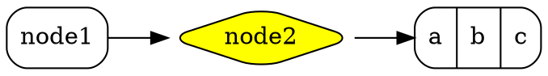
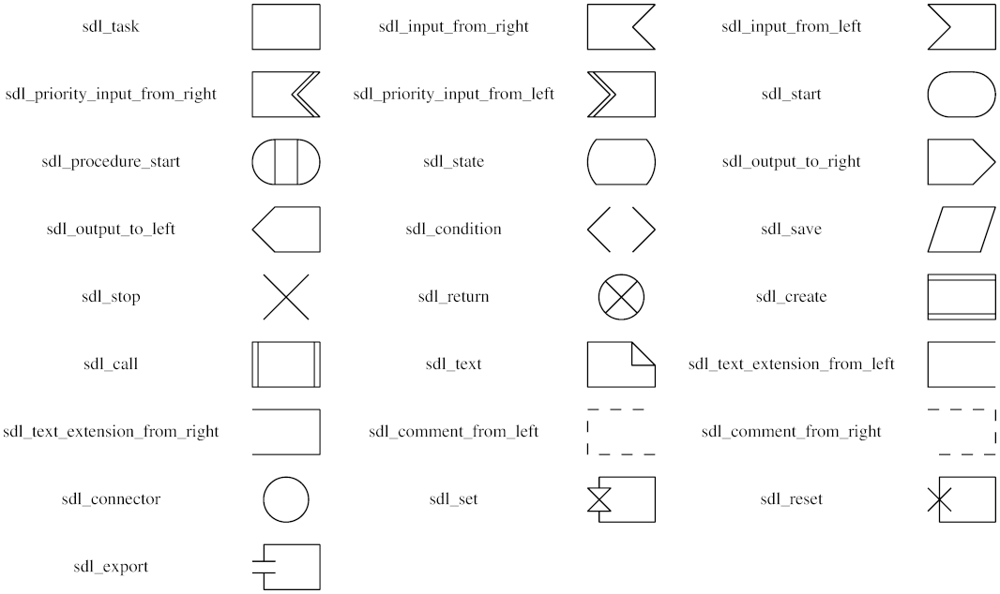

# 节点形状

主要有三种形状：[基于多边形](https://graphviz.cpp.org.cn/doc/info/shapes.html#polygon)、[基于记录](https://graphviz.cpp.org.cn/doc/info/shapes.html#record) 和 [用户定义](https://graphviz.cpp.org.cn/doc/info/shapes.html#epsf)。

基于记录的形状在很大程度上已被 [HTML 类标签](https://graphviz.cpp.org.cn/doc/info/shapes.html#html) 取代并大大推广。也就是说，人们可以考虑使用 `shape=none`、`margin=0` 和 HTML 类标签，而不是使用 `shape=record`。

所有节点形状的几何形状和样式都受节点属性 [`fixedsize`](https://graphviz.cpp.org.cn/docs/attrs/fixedsize/)、[`fontname`](https://graphviz.cpp.org.cn/docs/attrs/fontname/)、[`fontsize`](https://graphviz.cpp.org.cn/docs/attrs/fontsize/)、[`height`](https://graphviz.cpp.org.cn/docs/attrs/height/)、[`label`](https://graphviz.cpp.org.cn/docs/attrs/label/)、[`style`](https://graphviz.cpp.org.cn/docs/attrs/style/) 和 [`width`](https://graphviz.cpp.org.cn/docs/attrs/width/) 的影响。

## 基于多边形的节点

下面显示了所有可能的基于多边形的形状。


如上图所示，`rect` 和 `rectangle` 形状是 `box` 的同义词，`none` 是 `plaintext` 的同义词。`plain` 形状类似于这两个形状，不同之处在于它还强制执行 `width=0 height=0 margin=0`，从而保证节点的实际大小完全由标签决定。例如，当使用 [HTML 类标签](https://graphviz.cpp.org.cn/doc/info/shapes.html#html) 时，这很有用。此外，与其他形状不同，我们已经显示了这三个形状以及 `underline`，但没有使用 `style=filled` 来表示正常使用。如果启用填充，标签文本将显示在填充的矩形中。

基于多边形的形状的几何形状还受节点属性 [`regular`](https://graphviz.cpp.org.cn/docs/attrs/regular/)、[`peripheries`](https://graphviz.cpp.org.cn/docs/attrs/peripheries/) 和 [`orientation`](https://graphviz.cpp.org.cn/docs/attrs/orientation/) 的影响。如果 `shape="polygon"`，则属性 [`sides`](https://graphviz.cpp.org.cn/docs/attrs/sides/)、[`skew`](https://graphviz.cpp.org.cn/docs/attrs/skew/) 和 [`distortion`](https://graphviz.cpp.org.cn/docs/attrs/distortion/) 也会被使用。如果未设置，则分别默认为 4、0.0 和 0.0。点形状很特殊，它只受 [`peripheries`](https://graphviz.cpp.org.cn/docs/attrs/peripheries/)、[`width`](https://graphviz.cpp.org.cn/docs/attrs/width/) 和 [`height`](https://graphviz.cpp.org.cn/docs/attrs/height/) 属性的影响。

通常，节点的大小由包含其标签和图像（如果有）所需的最小宽度和高度决定，边距由 [`margin`](https://graphviz.cpp.org.cn/docs/attrs/margin/) 属性指定。宽度和高度还必须至少与 [`width`](https://graphviz.cpp.org.cn/docs/attrs/width/) 和 [`height`](https://graphviz.cpp.org.cn/docs/attrs/height/) 属性指定的大小一样大，这些属性指定了这些参数的最小值。有关限制节点大小的方法，请参阅 [`fixedsize`](https://graphviz.cpp.org.cn/docs/attrs/fixedsize/) 属性。特别地，如果 `fixedsize=shape`，则节点的形状将由 [`width`](https://graphviz.cpp.org.cn/docs/attrs/width/) 和 [`height`](https://graphviz.cpp.org.cn/docs/attrs/height/) 属性固定，并且该形状用于边缘终止，但形状和标签大小都用于防止节点重叠。例如，以下图表

```
digraph G {
  { 
    node [margin=0 fontcolor=blue fontsize=32 width=0.5 shape=circle style=filled]
    b [fillcolor=yellow fixedsize=true label="a very long label"]
    d [fixedsize=shape label="an even longer label"]
  }
  a -> {c d}
  b -> {c d}
}
```

生成以下图形


请注意，使用 `fixedsize=true` 的黄色节点的标签与另一个节点重叠，而使用 `fixedsize=shape` 的灰色节点有足够的空间。

这些形状：`note`、`tab`、`folder`、`box3d` 和 `component` 由 Pander 提供。合成生物学形状：`promoter`、`cds`、`terminator`、`utr`、`primersite`、`restrictionsite`、`fivepoverhang`、`threepoverhang`、`noverhang`、`assembly`、`signature`、`insulator`、`ribosite`、`rnastab`、`proteasesite`、`proteinstab`、`rpromoter`、`rarrow`、`larrow` 和 `lpromoter` 由 Jenny Cheng 贡献。


## 基于记录的节点

**注意：** 请参阅 [关于基于记录的节点的说明](https://graphviz.cpp.org.cn/doc/info/shapes.html#record-based-note)。还要注意，如果一个或两个节点具有记录形状，则在同一等级上的相邻节点之间使用非平凡边（具有端口或标签的边）会导致问题。

这些由形状值“record”和“Mrecord”指定。基于记录的节点的结构由其 [`label`](https://graphviz.cpp.org.cn/docs/attrs/label/) 决定，该标签具有以下模式

| *rlabel*       | = | *field* ( '|' *field* )*         |
| ----------------- | --- | ------------------------------------ |
| 其中 *field*   | = | *fieldId* 或 '{' *rlabel* '}'    |
| 以及 *fieldId* | = | [ '<' *string* '>'] [ *string* ] |

如果你希望花括号、竖线和尖括号作为字面字符出现，则必须使用反斜杠字符对其进行转义。空格被解释为标记之间的分隔符，因此如果你希望文本中包含空格，则必须对其进行转义。

*fieldId* 中的第一个字符串为字段分配端口名称，并且可以与节点名称组合以指示将边连接到节点的位置。（见 [portPos](https://graphviz.cpp.org.cn/docs/attr-types/portPos/)。）第二个字符串用作字段的文本；它支持常用的 [转义序列](https://graphviz.cpp.org.cn/docs/attr-types/escString/) `\n`、`\l` 和 `\r`。

从视觉上看，记录是一个框，字段由水平或垂直子框的交替行表示。Mrecord
形状与记录形状相同，只是最外层的框具有圆角。通过将字段嵌套在大括号“{...}”中来在水平布局和垂直布局之间切换。记录中的顶层方向是水平的。因此，标签为“A
| B | C | D”的记录将具有 4 个字段，从左到右排列，而“{A | B | C | D}”将从上到下排列，而“A | { B | C
} | D”将具有“B”在“C”上方，以及“A”在“B”和“C”的左侧，“D”在“B”和“C”的右侧。

记录节点的初始方向取决于 [rankdir](https://graphviz.cpp.org.cn/docs/attrs/rankdir/) 属性。如果此属性为 `TB`（默认值）或 `BT`，对应于垂直布局，则记录中的顶层字段将水平显示。但是，如果此属性为 `LR` 或 `RL`，对应于水平布局，则顶层字段将垂直显示。

作为记录节点的示例，dot 输入

```
digraph structs {
    node [shape=record];
    struct1 [label="<f0> left|<f1> mid\ dle|<f2> right"];
    struct2 [label="<f0> one|<f1> two"];
    struct3 [label="hello\nworld |{ b |{c|<here> d|e}| f}| g | h"];
    struct1:f1 -> struct2:f0;
    struct1:f2 -> struct3:here;
}
```


生成以下图形


如果我们添加一行

```
    rankdir=LR
```

我们将得到布局


如果我们将节点 `struct1` 的形状改为 `Mrecord`，它将看起来像


## 节点样式

可以使用 [`style`](https://graphviz.cpp.org.cn/docs/attrs/style/) 属性修改节点的外观。目前，识别 8 个样式值：`filled`、`invisible`、`diagonals`、`rounded`。`dashed`、`dotted`、`solid` 和 `bold`。与往常一样，[`style`](https://graphviz.cpp.org.cn/docs/attrs/style/) 属性的值可以是这些值中的任何一个的逗号分隔列表。如果样式包含冲突（例如，`style="dotted, solid"`），则最后一个属性生效。

`filled`
此值表示应填充节点的内部。使用的颜色是节点的 `fillcolor`，或者如果未定义，则为其 `color`。对于未填充的节点，节点的内部对当前图形或集群背景颜色是透明的。请注意，`point` 形状始终是填充的。因此，代码

```
digraph G {
  rankdir=LR
  node [shape=box, color=blue]
  node1 [style=filled] 
  node2 [style=filled, fillcolor=red] 
  node0 -> node1 -> node2
}
```

生成以下图形


`invisible`
设置此样式会导致节点根本不显示。请注意，节点仍然用于布置图形。
`diagonals`
diagonals 样式会导致在节点多边形的顶点附近绘制小的弦，或者在圆形和椭圆形的情况下，在形状的顶部和底部附近绘制两条弦。特殊节点形状 [`Msquare`](https://graphviz.cpp.org.cn/doc/info/shapes.html#d:Msquare)、[`Mcircle`](https://graphviz.cpp.org.cn/doc/info/shapes.html#d:Mcircle) 和 [`Mdiamond`](https://graphviz.cpp.org.cn/doc/info/shapes.html#d:Mdiamond) 只是一个普通的正方形、圆形和菱形，设置了 diagonals 样式。
`rounded`
rounded 样式会导致多边形角被平滑。请注意，此样式也适用于基于记录的节点。实际上，`Mrecord` 形状只是设置此样式的简写。此外，在 2005 年 4 月 26 日之前，rounded 和 filled 样式是相互排斥的。作为圆角的示例，dot 使用图形




来生成图形


`dashed`
此样式会导致节点的边框以虚线绘制。
`dotted`
此样式会导致节点的边框以点线绘制。
`solid`
此样式会导致节点的边框以实线绘制，这是默认设置。
`bold`
此样式会导致节点的边框以粗线绘制。另见 [penwidth](https://graphviz.cpp.org.cn/docs/attrs/penwidth/)。

其他样式可能在特定代码生成器中可用。

## HTML 类标签

**注意：** 此功能仅适用于 2003 年 11 月中旬以后版本的 Graphviz。特别是，它不属于版本 1.10。

**注意：** 粗体、斜体、下划线、下标和上标的字体标记 ([`<B>`](https://graphviz.cpp.org.cn/doc/info/shapes.html#b)、[`<I>`](https://graphviz.cpp.org.cn/doc/info/shapes.html#i)、[`<U>`](https://graphviz.cpp.org.cn/doc/info/shapes.html#u)、[`<SUB>`](https://graphviz.cpp.org.cn/doc/info/shapes.html#sub) 和 [`<SUP>`](https://graphviz.cpp.org.cn/doc/info/shapes.html#sup)) 仅在 2011 年 10 月 14 日之后的版本中可用，而删除线标记 ([`<S>`](https://graphviz.cpp.org.cn/doc/info/shapes.html#s)) 需要 2013 年 9 月 15 日之后的版本。此外，所有这些标记目前仅通过 cairo 和 svg 渲染器可用。水平线和垂直线 ([`<HR>`](https://graphviz.cpp.org.cn/doc/info/shapes.html#hr) 和 [`<VR>`](https://graphviz.cpp.org.cn/doc/info/shapes.html#vr)) 仅在 2011 年 7 月 8 日之后的版本中可用。

**注意：** 对于 2014 年 9 月 9 日之后的版本，可以使用 `shape=plain`，以便节点的大小完全由标签决定。否则，节点的边距、宽度和高度值可能会导致节点变大，从而导致边从标签中剪切掉。实际上，`shape=plain` 是 `shape=none width=0 height=0 margin=0` 的简写。

如果标签属性的值 ([`label`](https://graphviz.cpp.org.cn/docs/attrs/label/) 用于节点、边、集群和图形，以及 [`headlabel`](https://graphviz.cpp.org.cn/docs/attrs/headlabel/) 和 [`taillabel`](https://graphviz.cpp.org.cn/docs/attrs/taillabel/) 用于边的属性) 被赋予为 [HTML 字符串](https://graphviz.cpp.org.cn/doc/info/lang.html#html-strings)，即由 `<...>` 而不是 `"..."` 分隔，则该标签被解释为 HTML 描述。最简单的情况下，此类标签可以描述由普通 [字符串标签](https://graphviz.cpp.org.cn/docs/attr-types/escString/) 提供的各种对齐方式的多行文本。更一般地说，标签可以指定与 HTML 提供的类似的表格，在每个级别具有不同的图形属性。

由于 [HTML 字符串](https://graphviz.cpp.org.cn/doc/info/lang.html#html-strings) 像 HTML 输入一样被处理，因此字面文本或属性值中对 `"`、`&`、`<` 和 `>` 字符的任何使用都需要替换为相应的转义序列。例如，如果你想在 `href` 值中使用 `&`，这应该表示为 `&amp;`。

**注意：** 这些标签支持的功能和语法是根据 HTML 建模的。但是，有很多方面与 Graphviz

标签相关，而这些方面不在 HTML 中，反之，HTML 允许各种在 Graphviz 中毫无意义的结构。我们通常会将这些标签称为“HTML
标签”，而不是笨拙的“HTML 类标签”，但读者应该注意，这些标签并不是真正的 HTML。下面的语法准确地描述了 Graphviz
将接受的内容。

虽然 HTML 标签从严格意义上来说不是一种形状，但可以将它们视为上面描述的记录形状的概括。特别是，如果一个节点将其 [`shape`](https://graphviz.cpp.org.cn/docs/attr-types/shape/) 属性设置为 `none` 或 `plaintext`，则 HTML 标签将成为节点的形状。另一方面，如果节点具有任何其他形状（除了 `point`），则 HTML 标签将像普通标签一样嵌入到节点中。不建议将 HTML 标签添加到基于记录的形状（record 和 Mrecord），因为它们可能会导致意外行为，因为它们的标签模式和重叠功能存在冲突。


以下是 HTML 标签的抽象语法。终端（对应于元素）以粗体显示，非终端以斜体显示。方括号 `[` 和 `]` 包含可选项目。竖线 `|` 分隔备选方案。请注意，与 HTML 一样，元素和属性名称不区分大小写。（参见 [HTML 4.01 规范](http://www.w3.org/TR/html401) 的第 3.2.1 节和第 3.2.2 节）。

| *label*     | : | *text*                                              |
| ------------- | - | ----------------------------------------------------- |
|               |   |                                                       |
| *text*      | : | *textitem*                                          |
|               |   |                                                       |
| *textitem*  | : | *string*                                            |
|               |   |                                                       |
|               |   |                                                       |
|               |   |                                                       |
|               |   |                                                       |
|               |   |                                                       |
|               |   |                                                       |
|               |   |                                                       |
|               |   |                                                       |
|               |   |                                                       |
| *fonttable* | : | *table*                                             |
|               |   |                                                       |
|               |   |                                                       |
|               |   |                                                       |
|               |   |                                                       |
|               |   |                                                       |
| *table*     | : | **`<TABLE>`** *rows* **`</TABLE>`** |
| *rows*      | : | *row*                                               |
|               |   |                                                       |
|               |   |                                                       |
| *row*       | : | **`<TR>`** *cells* **`</TR>`**      |
| *cells*     | : | *cell*                                              |
|               |   |                                                       |
|               |   |                                                       |
| *cell*      | : | **`<TD>`** *label* **`</TD>`**      |
|               |   |                                                       |

所有非打印字符（如制表符或换行符）将被忽略。在上面，*string* 是任何可打印字符的集合，包括空格。对于表格，在 [`<TD>`](https://graphviz.cpp.org.cn/doc/info/shapes.html#td) 元素主体之外，空格字符将被忽略，包括空格；在 [`<TD>`](https://graphviz.cpp.org.cn/doc/info/shapes.html#td) 元素内部，空格将被保留，但所有其他空格字符将被丢弃。**注意** 由于技术原因，如果表格被包装在字体元素（如 [`<FONT>`](https://graphviz.cpp.org.cn/doc/info/shapes.html#font) 或 [`<B>`](https://graphviz.cpp.org.cn/doc/info/shapes.html#b)）中，则此元素前后出现的任何空格都将导致语法错误。例如，标签


```
< <U><TABLE><TR><TD>a</TD></TR></TABLE></U>>
```

不合法。删除空格或 `<U>...</U>` 将修复此问题。

HTML 注释在 HTML 字符串中是允许的。它们可以出现在任何地方，前提是如果它们包含 HTML 元素的一部分，则它们必须包含整个元素。

从上面的描述中可以明显看出，空格字符的解释是 HTML 类标签与标准 HTML 非常不同的一个地方。在 HTML 中，任何空格字符序列都被折叠为单个空格。如果用户不希望发生这种情况，则输入必须使用不间断空格 `&nbsp;`。这对 HTML 来说是有意义的，因为文本布局动态地依赖于可用空间。在 Graphviz 中，布局由输入静态地确定，因此将普通空格字符视为不间断字符是合理的。此外，忽略制表符和换行符允许格式化输入文本以方便阅读。

每个 HTML 元素都有一组可选属性。属性值必须出现在双引号中。

表格元素

```
<TABLE
  ALIGN="CENTER|LEFT|RIGHT"
  BGCOLOR="color"
  BORDER="value"
  CELLBORDER="value"
  CELLPADDING="value"
  CELLSPACING="value"
  COLOR="color"
  COLUMNS="value"
  FIXEDSIZE="FALSE|TRUE"
  GRADIENTANGLE="value"
  HEIGHT="value"
  HREF="value"
  ID="value"
  PORT="portName"
  ROWS="value"
  SIDES="value"
  STYLE="value"
  TARGET="value"
  TITLE="value"
  TOOLTIP="value"
  VALIGN="MIDDLE|BOTTOM|TOP"
  WIDTH="value"
>
```

表格行

```
<TR
  <!-- No attributes -->
>
```

表格单元格

```
<TD
  ALIGN="CENTER|LEFT|RIGHT|TEXT"
  BALIGN="CENTER|LEFT|RIGHT"
  BGCOLOR="color"
  BORDER="value"
  CELLPADDING="value"
  CELLSPACING="value"
  COLOR="color"
  COLSPAN="value"
  FIXEDSIZE="FALSE|TRUE"
  GRADIENTANGLE="value"
  HEIGHT="value"
  HREF="value"
  ID="value"
  PORT="portName"
  ROWSPAN="value"
  SIDES="value"
  STYLE="value"
  TARGET="value"
  TITLE="value"
  TOOLTIP="value"
  VALIGN="MIDDLE|BOTTOM|TOP"
  WIDTH="value"
>
```

字体规范

```
<FONT
  COLOR="color"
  FACE="fontname"
  POINT-SIZE="value"
>
```

换行符

```
<BR
  ALIGN="CENTER|LEFT|RIGHT"
/>
```

图像包含

```

```

斜体样式

```
<I
  <!-- No attributes -->
>
```

粗体样式

```
<B
  <!-- No attributes -->
>
```

下划线文本

```
<U
  <!-- No attributes -->
>
```

上划线文本

```
<O
  <!-- No attributes -->
>
```

下标文本

```
<SUB
  <!-- No attributes -->
>
```

上标文本

```
<SUP
  <!-- No attributes -->
>
```

删除线文本

```
<S
  <!-- No attributes -->
>
```

水平线

```
<HR
  <!-- No attributes -->
/>
```

垂直线

```
<VR
  <!-- No attributes -->
/>
```

ALIGN
指定水平放置。当对象分配的空间比需要的大时，此值决定了额外的空间在对象左右两侧放置的位置。* `CENTER` 将对象居中对齐。（默认值）

* `LEFT` 将对象左对齐。
* `RIGHT` 将对象右对齐。
* ([`<TD>`](https://graphviz.cpp.org.cn/doc/info/shapes.html#td) 仅)`TEXT` 使用完整的单元格宽度对齐文本行。一行的对齐方式由其（可能隐式的）关联的[`<BR>`](https://graphviz.cpp.org.cn/doc/info/shapes.html#br) 元素决定。

单元格内容通常以块状方式对齐。特别是，文本行首先根据最宽行的宽度和相应的 [`<BR>`](https://graphviz.cpp.org.cn/doc/info/shapes.html#br) 元素对齐为文本块。然后，整个文本块在单元格内对齐。但是，如果单元格的 ***ALIGN*** 值为 `TEXT`，并且单元格包含文本行，则使用单元格的整个可用宽度对文本行进行两端对齐。如果单元格不包含文本，则包含的图像或表格将居中。

BALIGN

指定单元格中包含的 [`<BR>`](https://graphviz.cpp.org.cn/doc/info/shapes.html#br) 元素的默认对齐方式。也就是说，如果 [`<BR>`](https://graphviz.cpp.org.cn/doc/info/shapes.html#br) 元素没有显式的 [***ALIGN***](https://graphviz.cpp.org.cn/doc/info/shapes.html#align) 属性，则属性值由 ***BALIGN*** 的值指定。
BGCOLOR="color"
设置背景颜色。此颜色可以被子元素中的 ***BGCOLOR*** 属性覆盖。该值可以是单一颜色或以冒号分隔的两种颜色，后者表示渐变填充。
BORDER="value"
指定对象周围边框的宽度（以磅为单位）。值为零表示没有边框。默认值为 1。最大值为 255。如果在表格中设置，并且 [***CELLBORDER***](https://graphviz.cpp.org.cn/doc/info/shapes.html#cellborder) 未设置，则此值也用于表格中的所有单元格。它可以被单元格中的 ***BORDER*** 属性覆盖。
CELLBORDER="value"
指定表格中所有单元格的边框宽度。它可以被单元格中的 [***BORDER***](https://graphviz.cpp.org.cn/doc/info/shapes.html#border) 标签覆盖。最大值为 127。
CELLPADDING="value"
指定单元格边框与其内容之间的间距（以磅为单位）。默认值为 2。最大值为 255。
CELLSPACING="value"
指定表格中单元格之间以及单元格与表格边框之间的间距（以磅为单位）。默认值为 2。最大值为 127。
COLOR="color"
设置 [`<FONT>...</FONT>`](https://graphviz.cpp.org.cn/doc/info/shapes.html#font) 范围内的字体颜色，或 [`<TABLE>...</TABLE>`](https://graphviz.cpp.org.cn/doc/info/shapes.html#table) 或 [`<TD>...</TD>`](https://graphviz.cpp.org.cn/doc/info/shapes.html#td) 范围内的表格或单元格的边框颜色。此颜色可以被子元素中的 ***COLOR*** 属性覆盖。默认情况下，字体颜色由对应节点、边或图的 [fontcolor](https://graphviz.cpp.org.cn/docs/attrs/fontcolor/) 属性决定，边框颜色由对应节点、边或图的 [color](https://graphviz.cpp.org.cn/docs/attrs/color/) 属性决定。
COLSPAN="value"
指定单元格跨越的列数。默认值为 1。最大值为 65535。
COLUMNS="value"
提供有关列的一般格式信息。目前，唯一合法的值为 `*`，这会导致在每一行中每个单元格之间出现一条垂直线。
FACE="fontname"
指定 [`<FONT>...</FONT>`](https://graphviz.cpp.org.cn/doc/info/shapes.html#font) 范围内的字体。这可以被子元素中的 ***FACE*** 属性覆盖。默认情况下，字体名称由对应节点、边或图的 [fontname](https://graphviz.cpp.org.cn/docs/attrs/fontname/) 属性决定。
FIXEDSIZE
指定 [***WIDTH***](https://graphviz.cpp.org.cn/doc/info/shapes.html#width) 和 [***HEIGHT***](https://graphviz.cpp.org.cn/doc/info/shapes.html#height) 属性给出的值是否强制执行。* FALSE 允许对象增长，以便所有内容都适合。（默认）

* TRUE 将对象大小固定到其给定的[***WIDTH***](https://graphviz.cpp.org.cn/doc/info/shapes.html#width) 和[***HEIGHT***](https://graphviz.cpp.org.cn/doc/info/shapes.html#height)。这两个属性都必须提供。

GRADIENTANGLE="value"
如果 [***BGCOLOR***](https://graphviz.cpp.org.cn/doc/info/shapes.html#bgcolor) 是颜色列表，则给出渐变填充中使用的角度。对于默认的线性渐变，这指定了通过中心的线的角度，沿着该线颜色转换。因此，角度为 0 会导致从左到右的进度。对于径向渐变（参见 [***STYLE***](https://graphviz.cpp.org.cn/doc/info/shapes.html#style)），角度指定着色中心的 位置。角度为 0 将中心放置在表格或单元格的中心；非零角度将填充中心放置在靠近边界的那个角度。
HEIGHT="value"
指定对象最小高度（以磅为单位）。高度包括内容、任何间距和边框。除非 [***FIXEDSIZE***](https://graphviz.cpp.org.cn/doc/info/shapes.html#fixedsize) 为 true，否则高度将被扩展以允许内容适合。最大值为 65535。
HREF="value"
将 URL 附加到对象。请注意，`"value"` 被视为 [escString](https://graphviz.cpp.org.cn/docs/attr-types/escString/)，类似于 [URL](https://graphviz.cpp.org.cn/docs/attrs/URL/) 属性。
ID="value"
允许用户为表格或单元格指定唯一的 ID。有关更多信息，请参见 [id](https://graphviz.cpp.org.cn/docs/attrs/id/) 属性。请注意，`"value"` 被视为 [escString](https://graphviz.cpp.org.cn/docs/attr-types/escString/)，类似于 [id](https://graphviz.cpp.org.cn/docs/attrs/id/) 属性。
POINT-SIZE="value"
设置 `<FONT>...</FONT>` 范围内使用的字体大小（以磅为单位）。这可以被子元素中的 ***POINT-SIZE*** 属性覆盖。默认情况下，字体大小由对应节点、边或图的 [fontsize](https://graphviz.cpp.org.cn/docs/attrs/fontsize/) 属性决定。
PORT="value"
将端口名称附加到对象。（参见 [portPos](https://graphviz.cpp.org.cn/docs/attr-types/portPos/)。）这可以用来修改边的头部或尾部，以便末端直接附加到对象。
ROWS="value"
提供有关行的一般格式信息。目前，唯一合法的值为 `*`，这会导致在每一行之间出现一条水平线。
ROWSPAN="value"
指定单元格跨越的行数。默认值为 1。最大值为 65535。
SCALE
指定图像将在其单元格中使用任何额外可用空间的方式。允许的值是* `FALSE` : 保持图像的自然大小。（默认）

* `TRUE` : 将图像均匀缩放以适合。
* `WIDTH` : 扩展图像宽度以填充
* `HEIGHT` : 扩展图像高度以填充
* `BOTH` : 扩展图像宽度高度以填充 如果此属性未定义，图像将继承正在绘制的图形对象的[imagescale](https://graphviz.cpp.org.cn/docs/attrs/imagescale/) 属性。与[imagescale](https://graphviz.cpp.org.cn/docs/attrs/imagescale/) 属性一样，如果单元格具有固定大小，并且图像太大，任何有问题的尺寸将被缩小以适合空间，如果*SCALE=`"true"`* ，则缩放在宽度和高度上是均匀的。请注意，包含单元格的[***ALIGN***](https://graphviz.cpp.org.cn/doc/info/shapes.html#align) 和[***VALIGN***](https://graphviz.cpp.org.cn/doc/info/shapes.html#valign) 属性会覆盖图像的[***SCALE***](https://graphviz.cpp.org.cn/doc/info/shapes.html#scale) 属性。

SIDES="value"
指定如果绘制了边框，则应绘制单元格或表格中边框的哪几面。默认情况下，所有侧面都将绘制。`"value"` 字符串可以包含任何集合的（不区分大小写）字符 `'L'`、`'T'`、`'R'` 或 `'B'`，分别对应边框的左侧、顶部、右侧和底部。例如，`SIDES="LB"` 将指示只应绘制边框的左侧和底部段。
SRC="value"
指定要显示在单元格中的图像文件。请注意，如果软件用作 Web 服务器，则对图像的文件系统访问权限更加严格。参见 [SERVER_NAME](https://graphviz.cpp.org.cn/doc/info/command.html#d:SERVER_NAME).
STYLE
指定表格或单元格的样式特征。样式特征以逗号或空格分隔的样式属性列表形式给出。目前，唯一合法的属性是 `ROUNDED` 和 `RADIAL` 用于表格，`RADIAL` 用于单元格。如果指定了 `ROUNDED`，则表格将具有圆角。这可能最适合最外层的单元格没有边框，或者它们的 [`CELLSPACING`](https://graphviz.cpp.org.cn/doc/info/shapes.html#cellspacing) 足够大。如果希望在单元格周围有边框，请使用 [***HR***](https://graphviz.cpp.org.cn/doc/info/shapes.html#hr) 和 [***VR***](https://graphviz.cpp.org.cn/doc/info/shapes.html#vr) 元素，或 [***COLUMNS***](https://graphviz.cpp.org.cn/doc/info/shapes.html#columns) 和 [***ROWS***](https://graphviz.cpp.org.cn/doc/info/shapes.html#rows) 属性 [***TABLE***](https://graphviz.cpp.org.cn/doc/info/shapes.html#table)。`RADIAL` 属性表示径向渐变填充。参见 [***BGCOLOR***](https://graphviz.cpp.org.cn/doc/info/shapes.html#bgcolor) 和 [***GRADIENTANGLE***](https://graphviz.cpp.org.cn/doc/info/shapes.html#gradientangle) 属性。

TARGET="value"
确定如果对象具有 URL，则使用浏览器中的哪个窗口来显示 URL。参见 [W3C 文档](http://www.w3.org/TR/html401/present/frames.html#adef-target)。请注意，`"value"` 被视为 [escString](https://graphviz.cpp.org.cn/docs/attr-types/escString/)，类似于 [target](https://graphviz.cpp.org.cn/docs/attrs/target/) 属性。
TITLE="value"
设置附加到元素的工具提示注释。这仅在元素具有 [`HREF`](https://graphviz.cpp.org.cn/doc/info/shapes.html#href) 属性时使用。请注意，`"value"` 被视为 [escString](https://graphviz.cpp.org.cn/docs/attr-types/escString/)，类似于 [tooltip](https://graphviz.cpp.org.cn/docs/attrs/tooltip/) 属性。
TOOLTIP="value"
是 [***TITLE***](https://graphviz.cpp.org.cn/doc/info/shapes.html#title) 的别名。
VALIGN
指定垂直放置。当对象分配的空间大于所需空间时，此值将确定将多余的空间放置在对象的上方和下方的位置。* `MIDDLE` 将对象对齐到中心。（默认）

* `BOTTOM` 将对象对齐到底部。
* `TOP` 将对象对齐到顶部。

WIDTH="value"
指定对象最小宽度（以磅为单位）。宽度包括内容、任何间距和边框。除非 [***FIXEDSIZE***](https://graphviz.cpp.org.cn/doc/info/shapes.html#fixedsize) 为 true，否则宽度将被扩展以允许内容适合。最大值为 65535。

属性之间存在一些继承关系。如果表格指定了 [***CELLPADDING***](https://graphviz.cpp.org.cn/doc/info/shapes.html#cellpadding)、[***CELLBORDER***](https://graphviz.cpp.org.cn/doc/info/shapes.html#cellborder) 或 [***BORDER***](https://graphviz.cpp.org.cn/doc/info/shapes.html#border) 值，则此值将由表格的单元格使用，除非被覆盖。如果单元格或表格指定了 ***BGCOLOR*** ，这将是其所有子元素的背景颜色。当然，如果为拥有标签的图形对象指定了背景或填充颜色，这将是标签的原始背景。对象的 fontname、fontcolor 和 fontsize 属性是绘制文本的默认值。这些可以通过使用 [***FONT***](https://graphviz.cpp.org.cn/doc/info/shapes.html#font) 来设置新值来覆盖。新的字体值将保持，直到被包含的 [***FONT***](https://graphviz.cpp.org.cn/doc/info/shapes.html#font) 元素覆盖。最后，图形对象的 pencolor 或 color 将用作边框颜色。

如果您希望在表格中均匀地使用水平或垂直线，请考虑使用 [***COLUMNS***](https://graphviz.cpp.org.cn/doc/info/shapes.html#columns) 或 [***ROWS***](https://graphviz.cpp.org.cn/doc/info/shapes.html#rows) 属性，而不是使用许多 [***HR***](https://graphviz.cpp.org.cn/doc/info/shapes.html#hr) 和 [***VR***](https://graphviz.cpp.org.cn/doc/info/shapes.html#vr) 元素。

由于在以设备无关方式处理表格方面存在某些限制，当 [***BORDER***](https://graphviz.cpp.org.cn/doc/info/shapes.html#border) 为 1 并且表格和单元格边框都处于打开状态，并且 [***CELLSPACING***](https://graphviz.cpp.org.cn/doc/info/shapes.html#cellspacing) 小于 2 时，输出中可能会出现异常，例如边框两侧之间的间隙，这些边框应该相接甚至共线。用户通常可以通过增加边框大小或间距，或者关闭表格边框来解决此问题。

### HTML 类标签示例

#### 重新创建记录示例

点输入

```
digraph structs {
    node [shape=plaintext]
    struct1 [label=<
<TABLE BORDER="0" CELLBORDER="1" CELLSPACING="0">
  <TR><TD>left</TD><TD PORT="f1">mid dle</TD><TD PORT="f2">right</TD></TR>
</TABLE>>];
    struct2 [label=<
<TABLE BORDER="0" CELLBORDER="1" CELLSPACING="0">
  <TR><TD PORT="f0">one</TD><TD>two</TD></TR>
</TABLE>>];
    struct3 [label=<
<TABLE BORDER="0" CELLBORDER="1" CELLSPACING="0" CELLPADDING="4">
  <TR>
    <TD ROWSPAN="3">hello<BR/>world</TD>
    <TD COLSPAN="3">b</TD>
    <TD ROWSPAN="3">g</TD>
    <TD ROWSPAN="3">h</TD>
  </TR>
  <TR>
    <TD>c</TD><TD PORT="here">d</TD><TD>e</TD>
  </TR>
  <TR>
    <TD COLSPAN="3">f</TD>
  </TR>
</TABLE>>];
    struct1:f1 -> struct2:f0;
    struct1:f2 -> struct3:here;
}
```

生成上面记录示例的 HTML 等效内容


与往常一样，HTML 规范更详细。

#### 更复杂的示例

另一方面，HTML 标签更加通用

```
digraph G {
  rankdir=LR
  node [shape=plaintext]
  a [
     label=<
<TABLE BORDER="0" CELLBORDER="1" CELLSPACING="0">
  <TR><TD ROWSPAN="3" BGCOLOR="yellow">class</TD></TR>
  <TR><TD PORT="here" BGCOLOR="lightblue">qualifier</TD></TR>
</TABLE>>
  ]
  b [shape=ellipse style=filled
     label=<
<TABLE BGCOLOR="bisque">
  <TR>
      <TD COLSPAN="3">elephant</TD> 
      <TD ROWSPAN="2" BGCOLOR="chartreuse" 
          VALIGN="bottom" ALIGN="right">two</TD>
  </TR>
  <TR>
    <TD COLSPAN="2" ROWSPAN="2">
      <TABLE BGCOLOR="grey">
        <TR><TD>corn</TD></TR> 
        <TR><TD BGCOLOR="yellow">c</TD></TR> 
        <TR><TD>f</TD></TR> 
      </TABLE>
    </TD>
    <TD BGCOLOR="white">penguin</TD> 
  </TR> 
  <TR>
    <TD COLSPAN="2" BORDER="4" ALIGN="right" PORT="there">4</TD>
  </TR>
</TABLE>>
  ]
  c [ 
  label=<long line 1<BR/>line 2<BR ALIGN="LEFT"/>line 3<BR ALIGN="RIGHT"/>>
  ]

  subgraph { rank=same b c }
  a:here -> b:there [dir=both arrowtail=diamond]
  c -> b
  d [shape=triangle]
  d -> c [label=<
<TABLE>
  <TR>
    <TD BGCOLOR="red" WIDTH="10"> </TD>
    <TD>Edge labels<BR/>also</TD>
    <TD BGCOLOR="blue" WIDTH="10"> </TD>
  </TR>
</TABLE>>
  ]
}
```

生成


#### 字体示例

使用 [`<FONT>`](https://graphviz.cpp.org.cn/doc/info/shapes.html#font) 元素的示例

```
digraph structs {
    node [shape=plaintext];

    struct1 [label=<<TABLE>
			<TR>
        <TD>line 1</TD>
        <TD BGCOLOR="blue"><FONT COLOR="white">line2</FONT></TD>
        <TD BGCOLOR="gray"><FONT POINT-SIZE="24.0">line3</FONT></TD>
        <TD BGCOLOR="yellow"><FONT POINT-SIZE="24.0" FACE="ambrosia">line4</FONT></TD>
        <TD>
          <TABLE CELLPADDING="0" BORDER="0" CELLSPACING="0">
						<TR>
							<TD><FONT COLOR="green">Mixed</FONT></TD>
							<TD><FONT COLOR="red">fonts</FONT></TD>
						</TR>
          </TABLE>
        </TD>
      </TR>
    </TABLE>>];
}
```


生成


#### 图像示例

使用 [``](https://graphviz.cpp.org.cn/doc/info/shapes.html#img) 元素

```
digraph structs {
    node [shape=plaintext];

    struct1 [label=<<TABLE>
      <TR><TD></TD></TR>
      <TR><TD>caption</TD></TR>
    </TABLE>>];
}
```


生成


#### 边示例

`sides` 属性（2.37 及更高版本）允许将单元格组合起来形成各种非凸形状。例如，一个 `tee-shaped` 节点

```
digraph {
  tee [shape=none margin=0 label=
    <<table border="0" cellspacing="0" cellborder="1">
     <tr>
      <td width="9" height="9" fixedsize="true" style="invis"></td>
      <td width="9" height="9" fixedsize="true" sides="ltr"></td>
      <td width="9" height="9" fixedsize="true" style="invis"></td>
     </tr>
     <tr>
      <td width="9" height="9" fixedsize="true" sides="tlb"></td>
      <td width="9" height="9" fixedsize="true" sides="b"></td>
      <td width="9" height="9" fixedsize="true" sides="brt"></td>
     </tr>
    </table>>]
}
```


生成


## 用户定义的节点形状

还有第三种节点形状类型，由用户指定。通常，这些形状依赖于具体图形格式的细节。目前，形状可以使用
PostScript（通过文件或附加库）来描述，用于 PostScript 输出，或者可以使用位图图像文件来指定形状，用于 SVG
或位图（jpeg、gif 等）输出。更多信息可以在页面 [如何创建自定义形状](https://graphviz.cpp.org.cn/faq/#FaqCustShape) 上找到。

## 用于 PostScript 的 SDL 形状

CSR 的 Mark Rison 提供了一个用户定义的节点形状示例。这些是 [SDL](http://www.sdl-forum.org/SDL/index.htm) 形状。这些形状作为 PostScript 函数提供，其用法在 [外部 PostScript 过程](https://graphviz.cpp.org.cn/faq/#ext_ps_proc) 中进行了描述。必要的 PostScript 库文件和示例用法可以在发行版中的 `contrib/sdlshapes` 目录中找到。请注意库文件 `sdl.ps` 中包含的版权和许可声明。

下表列出了形状名称及其对应的节点形状


